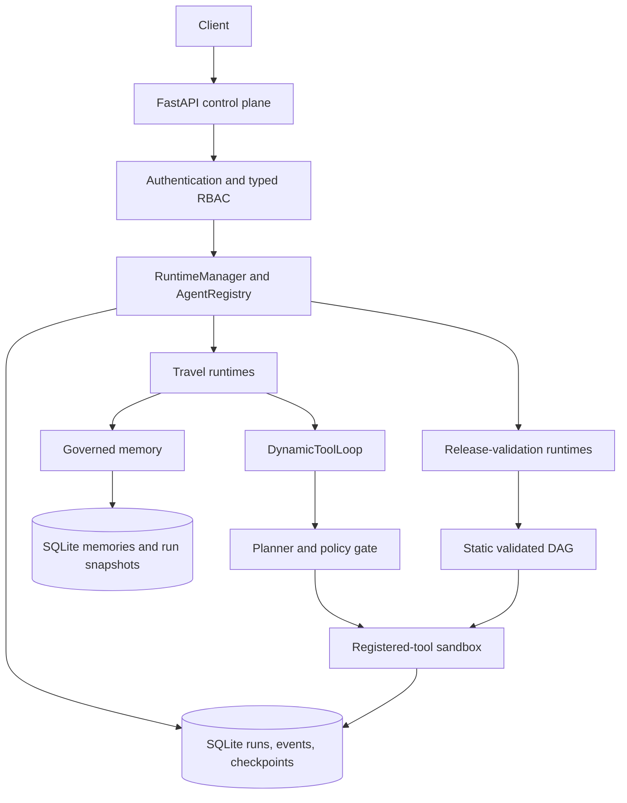
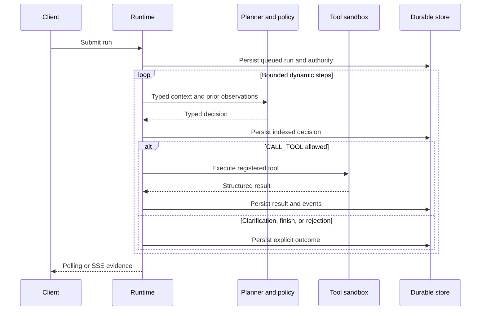

# Agent Runtime Reliability Platform

[](https://github.com/YingzuoLiu/agent-runtime-platform/actions/workflows/ci.yml)


[](LICENSE)

A production-oriented reference implementation for reliable Agent execution: typed Planner
decisions, policy-governed registered tools, durable state and events, restart-safe recovery,
multi-tenant authorization, governed cross-thread memory, and explicit failure semantics.

Travel is the first reference application, not the architecture boundary. A separate
release-validation domain exercises the same runtime through a deterministic DAG and selective
replay.

The default path is deterministic and offline: no LLM key, Redis, PostgreSQL, or Kubernetes is
required. An optional OpenAI Responses adapter drives the same typed loop with live model
decisions. All Travel tools use synthetic, read-only data; this repository does not search live
inventory, book travel, or take payment.

## Why this project exists

Agent failures are not only model-quality problems. They also come from state drift, silently
skipped constraints, duplicate execution, cancellation races, restart recovery, and unsafe tool
boundaries.

An early ablation in this repository produced a useful warning:

```text
full runtime completion rate: 50%
no-validator completion rate: 75%
```

The higher score was misleading. Trace inspection showed that the additional “successful” plan
violated the user's budget. The validator reduced nominal completion because it exposed an
invalid result instead of silently accepting it.

That finding became the design rule for the platform:

> Do not let the system look successful while failing somewhere the user or operator cannot see.

See [`FINDINGS.md`](FINDINGS.md) for the scenarios, traces, and ablation results.

## At a glance

| Concern | Implemented behavior | Where to inspect |
| --- | --- | --- |
| Planning | Strict `CALL_TOOL`, `REQUEST_CLARIFICATION`, and `FINISH` decisions | [`runtime_service/dynamic_loop.py`](runtime_service/dynamic_loop.py) |
| Policy | Fixed step-limit, allowlist, permission, and argument-schema checks before execution | [`docs/dynamic-tool-loop.md`](docs/dynamic-tool-loop.md) |
| Durability | SQLite-backed runs, events, checkpoints, Planner decisions, tool calls, and attempts | [`runtime_service/store.py`](runtime_service/store.py), [`runtime_service/workflow_store.py`](runtime_service/workflow_store.py) |
| Recovery | Decision replay, completed-result reuse, interrupted-step recovery, and pinned execution authority | [`tests/test_dynamic_tool_loop.py`](tests/test_dynamic_tool_loop.py) |
| Security | Fail-closed API-key auth, tenant isolation, Viewer/Operator RBAC, registered-tool sandboxing | [`runtime_service/auth.py`](runtime_service/auth.py), [`docs/cloud-runtime.md`](docs/cloud-runtime.md) |
| Memory | Subject-scoped versioned preferences, sealed run snapshots, audit events, and operational forgetting | [`docs/governed-memory.md`](docs/governed-memory.md) |
| Domains | Four Travel runtime versions plus fixed-order and DAG release-validation versions | [`runtime_service/registry.py`](runtime_service/registry.py) |
| Evidence | Typed REST/SSE events for Planner, policy, tool, recovery, and terminal outcomes | [`tests/test_dynamic_travel_api.py`](tests/test_dynamic_travel_api.py) |
| Verification | 322 tests; CI on Python 3.11 and 3.12 | [CI workflow](.github/workflows/ci.yml) |

## Quick start

```bash
python -m venv .venv
source .venv/bin/activate       # Windows: .venv\Scripts\activate
pip install -r requirements-dev.txt
pytest -q
```

Configure one local Operator credential and start the API:

```bash
export RUNTIME_API_KEY="replace-with-a-random-local-key"
export RUNTIME_API_KEYS_JSON='[{"credential_id":"local-demo","api_key":"replace-with-a-random-local-key","tenant_id":"tenant-demo","subject_id":"local-user","role":"operator"}]'
uvicorn api.main:app --reload
```

PowerShell equivalent:

```powershell
$env:RUNTIME_API_KEY = "replace-with-a-random-local-key"
$env:RUNTIME_API_KEYS_JSON = '[{"credential_id":"local-demo","api_key":"replace-with-a-random-local-key","tenant_id":"tenant-demo","subject_id":"local-user","role":"operator"}]'
uvicorn api.main:app --reload
```

Open [the interactive API docs](http://127.0.0.1:8000/docs), or verify the public health
endpoints:

```bash
curl http://127.0.0.1:8000/health
curl http://127.0.0.1:8000/ready
```

Submit a Phase 6A memory-governed Travel run:

```bash
curl -X POST http://127.0.0.1:8000/runs \
  -H "Authorization: Bearer $RUNTIME_API_KEY" \
  -H "Content-Type: application/json" \
  -d '{
    "thread_id": "dynamic-tokyo-trip-001",
    "agent_id": "travel-agent",
    "agent_version": "1.1.0",
    "input": {
      "user_message": "I want a 5-day Tokyo trip under 9000 SGD and avoid red-eye flights."
    }
  }'
```

Use the returned `run_id` to inspect the durable result and evidence:

```bash
curl -H "Authorization: Bearer $RUNTIME_API_KEY" \
  http://127.0.0.1:8000/runs/<run_id>

curl -H "Authorization: Bearer $RUNTIME_API_KEY" \
  http://127.0.0.1:8000/runs/<run_id>/events

curl -N -H "Authorization: Bearer $RUNTIME_API_KEY" \
  http://127.0.0.1:8000/runs/<run_id>/events/stream
```

The observable loop is:

```text
planner.decision -> policy.decision -> tool.result -> ... -> loop.outcome
```

The `1.1.0` path also emits `memory.retrieved` and, when the message contains an explicit
allowlisted stable preference, `memory.created` or `memory.superseded`. A new thread for the same
authenticated subject retrieves that preference automatically:

```bash
curl -H "Authorization: Bearer $RUNTIME_API_KEY" \
  http://127.0.0.1:8000/memories

curl -X DELETE -H "Authorization: Bearer $RUNTIME_API_KEY" \
  http://127.0.0.1:8000/memories/<memory_id>
```

If required information is missing, the completed run returns
`state.current_stage="needs_clarification"`. Submit another `travel-agent:1.1.0` run on the
same tenant-qualified thread to continue from its durable checkpoint.

## Architecture



Every protected request derives `Principal`, `TenantContext`, and `RuntimeRole` from a server-side
credential record. Request bodies cannot provide tenant identity, role, executable paths, handler
modules, Python source, or shell commands.

Dynamic runs persist the authenticated subject and the server-evaluated permission snapshot.
Async and restarted workers use that original execution authority rather than trusting the
request body or recomputing a later role.

### The Phase 5A execution loop



The domain-neutral loop owns decision parsing, policy order, durable step identity, recovery, and
stable runtime failures. Each domain owns Planner context construction, observation mapping, and
final validation. A Planner `FINISH` decision cannot bypass the Travel budget and preference
validator.

### The Phase 6A memory boundary

`travel-agent:1.1.0` retrieves only allowlisted, active preferences for the authenticated
`tenant_id + subject_id`. The first retrieval, including an empty result, is sealed per run before
Planner execution. Recovered attempts reuse that exact typed snapshot rather than querying current
memory again.

Current-message preferences override retrieved values. Values injected by `1.1.0` are execution
overlays, not thread-checkpoint preferences, so superseding or deleting them does not leave a stale
memory copy in that thread. Exact mutation history remains versioned and auditable. See
[`docs/governed-memory.md`](docs/governed-memory.md) for conflict, forgetting, and evidence
semantics.

## Registered runtime versions

Versions remain registered because durable runs pin exact behavior for recovery and replay.

| Agent | Version | Execution model | Purpose |
| --- | --- | --- | --- |
| `travel-agent` | `0.3.0` | Deterministic application runtime | Original typed state, reducer, validation, and partial replanning path |
| `travel-agent` | `0.5.0` | Deterministic review workflow | Budget and preference evidence review with validator-gated local replanning |
| `travel-agent` | `1.0.0` | Policy-governed dynamic loop | Observation-driven tool selection, clarification, and validated finish |
| `travel-agent` | `1.1.0` | Governed cross-thread memory | Subject-scoped typed preferences, sealed retrieval snapshots, and auditable forgetting |
| `release-validation` | `1.0.0` | Fixed-order workflow | Compatibility contract for existing durable runs |
| `release-validation` | `1.1.0` | Static validated DAG | Step persistence, selective replay, signature-safe evidence reuse |

The release-validation domain is independent of Travel. Its manifests, artifacts, compatibility
records, and tool results are synthetic fixtures. Scheduling is intentionally serial; no parallel
execution claim is made.

## Reliability and safety properties

### Typed state and visible failure

- Pydantic input, state, tool-argument, and Planner-decision contracts;
- explicit `StatePatch` transitions and deterministic nested-state reduction;
- strict rejection of unknown or cross-domain state fields;
- stable failure codes for invalid tools, arguments, permission, timeout, handler failure, step
  exhaustion, invalid Planner decisions, and provider failure;
- domain validation after Planner `FINISH`, with `FAILED` and `BLOCKED` kept distinct;
- typed evidence showing checked rules, skipped checks, blockers, and replanning directives.

### Durable execution and recovery

- asynchronous run lifecycle with append-only events and thread checkpoints;
- idempotent submission scoped by tenant and `client_request_id`;
- exact Agent-version pinning;
- atomic cancellation/completion guard;
- startup recovery for queued and running work;
- exclusive step claims and attempt-token protection;
- immutable selective-replay child runs with typed source and step lineage;
- replay of indexed Planner decisions and reuse of completed tool results;
- explicit interrupted-step recovery without silently retrying a persisted terminal tool failure;
- sealed per-run memory retrieval, including empty snapshots, across restart and retry;
- versioned preference conflict handling with idempotent same-value writes.

The safety claim is intentionally limited to deterministic, read-only tools. Booking, payment, or
other side-effecting tools would also need per-call idempotency, approval, and compensation
contracts.

### Tenant and tool boundaries

- fail-closed Bearer API-key authentication;
- tenant-qualified runs, idempotency keys, events, checkpoints, tool linkage, and replay sources;
- tenant-and-subject-qualified memory records, history, retrieval snapshots, and APIs;
- same-shape `404` responses for cross-tenant and unknown resources;
- centralized default-deny Viewer/Operator authorization;
- service-derived execution authority excluded from API responses;
- server-owned tool registry and Pydantic arguments with unknown fields rejected;
- fixed subprocess worker, fresh temporary working directory, scrubbed environment, timeout,
  bounded output, process-group termination, and POSIX resource limits;
- `tini` configured as container PID 1 for signal forwarding and orphan reaping.

The process sandbox protects trusted registered tools from accidental or unauthorized selection
and resource leakage. It is not a general untrusted-code sandbox: it does not isolate host
networking or create a private mount namespace.

## API surface

| Endpoint | Purpose | Viewer | Operator |
| --- | --- | ---: | ---: |
| `GET /health`, `GET /ready` | Liveness and readiness | public | public |
| `GET /agents`, `GET /tools` | Discover registered contracts | yes | yes |
| `GET /runs/{id}` | Read one tenant-scoped run | yes | yes |
| `GET /runs/{id}/events` | Read durable events | yes | yes |
| `GET /runs/{id}/events/stream` | Stream the same event model over SSE | yes | yes |
| `GET /threads/{id}/state` | Read the tenant-scoped checkpoint | yes | yes |
| `GET /memories` | Read the current subject's active or historical memory records | yes | yes |
| `POST /runs` | Create or selectively replay a run | no | yes |
| `POST /runs/{id}/cancel` | Request cooperative cancellation | no | yes |
| `POST /tools/{tool}/execute` | Execute a registered tool directly | no | yes |
| `POST /agent/message` | Call the synchronous Travel compatibility path | no | yes |
| `DELETE /memories/{id}` | Forget one logical memory key for future runs | no | yes |

`RUNTIME_API_KEYS_JSON` is the local credential provider. Every credential must declare
`viewer` or `operator`; missing or unknown roles fail configuration loading without retaining the
plaintext key in the validation exception chain. Plaintext keys are hashed when loaded and are not
retained by the authenticator. If the variable is absent or empty, every protected endpoint fails
closed with `401`.

This is deliberately small static RBAC, not a general policy platform.

## Optional live-model Planner

The default scripted Planner is deterministic and is the path used by normal CI. To drive the
same `travel-agent:1.0.0` loop through the OpenAI Responses adapter:

```bash
pip install -r requirements-model-demo.txt
export RUNTIME_PLANNER_PROVIDER=openai
export OPENAI_API_KEY="..."
export OPENAI_MODEL="..."
python examples/model_driven_travel_demo.py
```

The adapter exposes strict function schemas for the same three decisions and stores only typed
decisions and results. It does not persist the system prompt, raw provider response, or
provider-supplied terminal reasoning. CI uses a fake Responses client and does not claim to make a
live model request.

The Travel catalog remains synthetic in this mode.

## Selective replay example

`release-validation:1.1.0` creates a new immutable child run when replay is requested:

```bash
curl -X POST http://127.0.0.1:8000/runs \
  -H "Authorization: Bearer $RUNTIME_API_KEY" \
  -H "Content-Type: application/json" \
  -d '{
    "thread_id": "release-replay-2.4.0",
    "agent_id": "release-validation",
    "agent_version": "1.1.0",
    "input": {
      "manifest": {"...": "typed synthetic manifest fields"},
      "replay": {
        "source_run_id": "run_source",
        "step_ids": ["run_unit_tests"]
      }
    }
  }'
```

Requested nodes and their descendants rerun. Source evidence is copied only when node, tool, and
input signatures still match; the source run is never mutated.

## What to inspect first

| Path | Why it matters |
| --- | --- |
| [`runtime_service/dynamic_loop.py`](runtime_service/dynamic_loop.py) | Domain-neutral Planner/policy/tool state machine and recovery logic |
| [`runtime_service/manager.py`](runtime_service/manager.py) | Durable run lifecycle, worker queue, cancellation, and restart handoff |
| [`runtime_service/auth.py`](runtime_service/auth.py) | Principal derivation, typed permissions, and default-deny authorization |
| [`runtime_service/memory.py`](runtime_service/memory.py) | Versioned records, audit events, sealed snapshots, and run evidence |
| [`domains/travel/dynamic_runtime.py`](domains/travel/dynamic_runtime.py) | Reference adapter and domain-owned final validation |
| [`domains/travel/memory.py`](domains/travel/memory.py) | Allowlisted extraction and typed Travel preference mapping |
| [`domains/release_validation/runtime.py`](domains/release_validation/runtime.py) | Independent DAG workflow and selective replay adapter |
| [`tests/test_execution_authority.py`](tests/test_execution_authority.py) | Trusted authority, restart, tampering, and idempotent-resubmission proofs |

## Documentation map

- [`docs/dynamic-tool-loop.md`](docs/dynamic-tool-loop.md): Planner contracts, policy order,
  failure codes, recovery boundaries, and model adapter;
- [`docs/governed-memory.md`](docs/governed-memory.md): subject isolation, versioning, sealed
  retrieval, forgetting, RBAC, and audit evidence;
- [`docs/cloud-runtime.md`](docs/cloud-runtime.md): durable lifecycle, API, sandbox, deployment,
  and security model;
- [`docs/release-validation-workflow.md`](docs/release-validation-workflow.md): DAG validation,
  selective replay, identity hashing, retry, and interrupted recovery;
- [`docs/evidence-review-workflow.md`](docs/evidence-review-workflow.md): review contracts,
  partial results, local replanning, and semantic-analyzer boundary;
- [`FINDINGS.md`](FINDINGS.md): evaluation methodology and behavioral findings;
- [`docs/sample_trace.md`](docs/sample_trace.md): an annotated application-runtime trace.

Historical evaluation and reinforcement-learning artifacts remain under `eval/` and `rl/`; they
are not on the cloud-runtime request path.

## Tests and CI

Run the same static and behavioral gates used by GitHub Actions:

```bash
python -m compileall agent api runtime_service domains
ruff check agent api runtime_service tests domains
mypy
pytest -q
```

The suite covers typed reduction and validation, golden traces, review evidence, multi-turn
continuation, run lifecycle, cancellation races, restart recovery, idempotency, tenant isolation,
RBAC, schema migration, DAG validation, selective replay, tool sandboxing, all eight Phase 5A
failure codes, policy-order precedence, decision replay, cached tool results, execution authority,
REST/SSE evidence equality, and the fake OpenAI Responses boundary.
Phase 6A additionally covers cross-thread restart continuity, same-tenant subject isolation,
version conflicts, empty-snapshot sealing, memory RBAC, and deletion without checkpoint
resurrection.

GitHub Actions runs compile checks, Ruff, scoped Mypy, and pytest on Python 3.11 and 3.12.

## Deployment boundary

Docker, Docker Compose, and a deliberately single-replica Kubernetes manifest are included.
SQLite and the in-process queue keep the project self-contained, but they are not horizontally
scalable.

Before increasing replicas, the architecture would need:

```text
PostgreSQL runs/checkpoints/events/memories
+ Redis, Pub/Sub, or another distributed queue
+ worker leases and heartbeats
+ idempotent side-effect contracts
+ OpenTelemetry traces and metrics
+ container-backed sandbox workers
```

Docker Compose requires `RUNTIME_API_KEYS_JSON` from the caller environment. The Kubernetes
manifest expects the same JSON in Secret `travel-agent-runtime-auth`, key `api-keys.json`; the
repository does not contain or generate credential material.

## Deliberate limitations

This is a completed portfolio/reference milestone, not a claim of a complete production Agent
platform.

- SQLite rather than PostgreSQL, and an in-process queue rather than distributed workers;
- no worker lease, heartbeat, quota, token accounting, key rotation, or external secret manager;
- only two static roles, with no custom or per-Agent/per-tool grants;
- process isolation rather than a container, gVisor, or microVM sandbox;
- no arbitrary user-code or untrusted third-party MCP execution;
- serial DAG and dynamic-tool scheduling;
- synthetic Travel and release-validation data;
- no real flight, hotel, booking, payment, or other side-effecting API;
- no OpenTelemetry backend or evaluation dashboard;
- no prompt-injection detector beyond typed decisions, policy checks, and registered tools;
- memory is limited to explicit allowlisted preferences, without embeddings, inferred facts, or
  erasure of immutable historical run evidence;
- no exactly-once guarantee for future side-effecting tools.

Phase 6A is the completed portfolio milestone. Human approval, semantic memory retrieval, bounded
parallel read-only calls, a live read-only Travel adapter, multi-model fallback, and durable
multi-Agent delegation are possible follow-up slices, not prerequisites for the runtime
demonstrated here.

## License

This project is licensed under the [MIT License](LICENSE).
