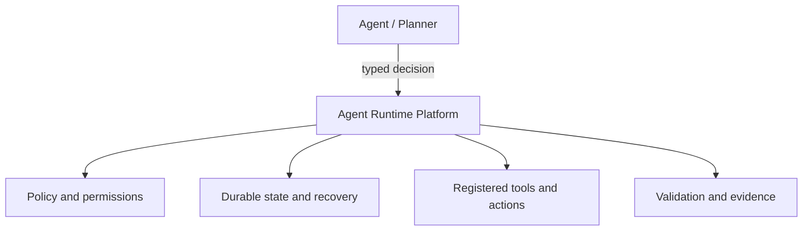
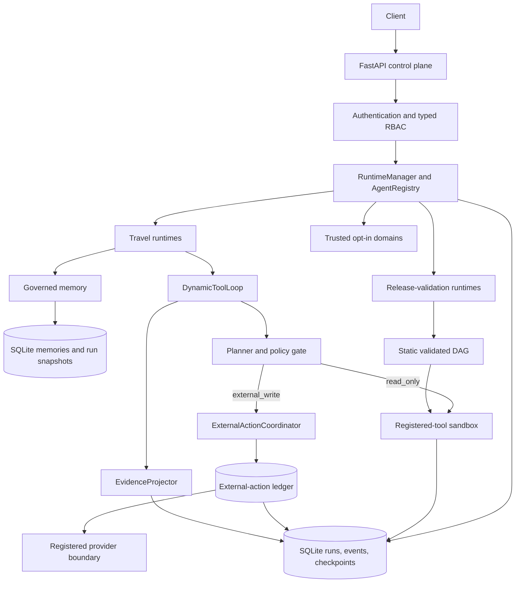
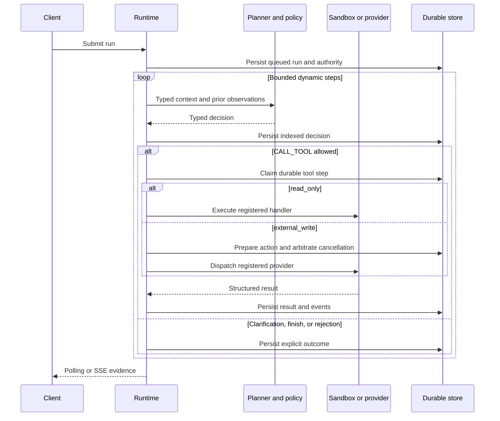

# Agent Runtime Platform

[](https://github.com/YingzuoLiu/agent-runtime-platform/actions/workflows/ci.yml)


[](LICENSE)

Many Agent projects focus on deciding what the Agent should do next. This project focuses on what
happens after that decision: executing Agent work durably, safely, recoverably, and observably.

Agent Runtime Platform is an execution layer between typed Agent decisions and real-world actions.
It owns durable state, policy-governed tools, recovery, tenant and memory boundaries, deterministic
validation, and evidence of what actually happened.

Travel is the main reference application, not the product boundary. A separate
`release-validation` domain exercises the same runtime through a deterministic DAG and selective
replay. Trusted deployment-time extensions can register additional typed domains without editing
Runtime Core; Phase 7C includes an opt-in synthetic incident-triage proof.
Phase 7D adds a narrow durable Action gateway so existing Agents and scripts can delegate an
allowlisted side effect without moving their Planner, memory, session, or main loop into this
runtime.

## Why an Agent Runtime?

An Agent can make the right decision and still fail during execution:

```text
Agent makes a decision
        ↓
real execution begins
        ↓
What if the process crashes?
What if a tool runs twice?
What if an external write succeeded but its response was lost?
What if cancellation races with dispatch?
What if this user or Agent lacks permission?
What if memory crosses a subject boundary?
What if the Planner says FINISH but constraints were violated?
What durable evidence tells us what happened?
```

Those are runtime problems rather than prompt-engineering problems.

An early ablation in this repository produced a useful warning:

```text
full runtime completion rate: 50%
no-validator completion rate: 75%
```

The higher score was misleading. Trace inspection showed that the additional “successful” plan
violated the user's budget. The validator reduced nominal completion because it exposed an
invalid result instead of silently accepting it.

That finding became the design rule for the platform:

> Do not let the system look successful while failing somewhere the user or operator cannot see.

See [`FINDINGS.md`](FINDINGS.md) for the scenarios, traces, and ablation results.

## Who this is for

This repository is for engineers evaluating how to move an Agent from an application-level loop to
an explicit execution boundary. It is also a runnable reference for discussions about tool safety,
durability, recovery, memory isolation, validation, and external side effects.

It is not a Travel product. Travel keeps the behavior concrete enough to run and inspect without
requiring live inventory, payment, Redis, PostgreSQL, Kubernetes, or an LLM key.

## See it work

```bash
git clone https://github.com/YingzuoLiu/agent-runtime-platform.git
cd agent-runtime-platform
docker compose up --build
```

Open [http://localhost:8000](http://localhost:8000), keep the example request, and select
**Run through Runtime**.

The first start builds the local image and may take several minutes while Python dependencies are
installed. Before an interview, run the command once to warm the Docker cache; later starts can use
`docker compose up` and reuse the built image.

The console submits directly through the existing authenticated `POST /runs` API, polls the durable
Run and Event resources, and renders only evidence returned by the runtime. A normal offline run
shows the actual execution sequence, including:

```text
planner.decision → policy.decision → search_trip_options
planner.decision → policy.decision → rank_trip_options
planner.decision → policy.decision → route_cost_summary
planner.decision → loop.outcome → checkpoint.saved → run.completed
```

The result panel is populated only after deterministic Travel validation accepts the selected
synthetic option. Expand any event to inspect its persisted payload.

The default Compose file is deliberately local-only: it binds to `127.0.0.1`, forces the scripted
offline Planner, and enables an ephemeral demo Operator session. Do not publish this mode. Without
`RUNTIME_DEMO_MODE=true`, `/demo` and its browser session endpoint do not exist, and protected API
routes remain fail-closed.

### Fallback without Docker

```bash
python -m venv .venv
source .venv/bin/activate       # Windows: .venv\Scripts\activate
pip install -r requirements.txt
RUNTIME_DEMO_MODE=true RUNTIME_PLANNER_PROVIDER=scripted \
  uvicorn api.main:app --host 127.0.0.1 --port 8000
```

PowerShell:

```powershell
python -m venv .venv
.venv\Scripts\Activate.ps1
pip install -r requirements.txt
$env:RUNTIME_DEMO_MODE = "true"
$env:RUNTIME_PLANNER_PROVIDER = "scripted"
uvicorn api.main:app --host 127.0.0.1 --port 8000
```

## What happens during execution?



The Agent or domain owns intent, Planner context, and final domain validation. The Runtime owns the
execution lifecycle: it persists authority and state, checks each tool call, prevents unsafe direct
writes, recovers pinned work, and exposes the same evidence through REST and SSE.

## At a glance

| Concern | Implemented behavior | Where to inspect |
| --- | --- | --- |
| Planning | Strict `CALL_TOOL`, `REQUEST_CLARIFICATION`, and `FINISH` decisions | [`runtime_service/dynamic_loop.py`](runtime_service/dynamic_loop.py) |
| Policy | Fixed step-limit, allowlist, permission, and argument-schema checks before execution | [`docs/dynamic-tool-loop.md`](docs/dynamic-tool-loop.md) |
| Durability | SQLite-backed runs, events, checkpoints, Planner decisions, tool calls, and attempts | [`runtime_service/store.py`](runtime_service/store.py), [`runtime_service/workflow_store.py`](runtime_service/workflow_store.py) |
| Recovery | Decision replay, completed-result reuse, interrupted-step recovery, and pinned execution authority | [`tests/test_dynamic_tool_loop.py`](tests/test_dynamic_tool_loop.py) |
| External actions | Prepared intent, provider dispatch fencing, bounded idempotent recovery, and explicit unknown outcomes | [`runtime_service/external_action_coordinator.py`](runtime_service/external_action_coordinator.py), [`docs/durable-external-actions.md`](docs/durable-external-actions.md) |
| Action gateway | `webhook.send` façade over a private single-step domain and the existing Run lifecycle | [`docs/durable-action-gateway.md`](docs/durable-action-gateway.md), [`examples/external_agent.py`](examples/external_agent.py) |
| Security | Fail-closed API-key auth, tenant isolation, Viewer/Operator RBAC, registered-tool sandboxing | [`runtime_service/auth.py`](runtime_service/auth.py), [`docs/cloud-runtime.md`](docs/cloud-runtime.md) |
| Memory | Subject-scoped versioned preferences, sealed run snapshots, audit events, and operational forgetting | [`docs/governed-memory.md`](docs/governed-memory.md) |
| Domains | Five Travel versions, two release-validation versions, and an opt-in trusted extension seam | [`docs/bring-your-own-domain.md`](docs/bring-your-own-domain.md) |
| Evidence | Workflow-first projection for Planner, policy, tool, action, and loop-outcome evidence; manager recovery events remain direct | [`runtime_service/evidence.py`](runtime_service/evidence.py), [`tests/test_durable_external_action_api.py`](tests/test_durable_external_action_api.py) |
| Product surface | Local Runtime Console over the same authenticated Run and Event APIs | [`api/demo_assets`](api/demo_assets), [`tests/test_demo_console.py`](tests/test_demo_console.py) |
| Verification | Full suite; CI on Python 3.11 and 3.12 | [CI workflow](.github/workflows/ci.yml) |

## API development setup

```bash
python -m venv .venv
source .venv/bin/activate       # Windows: .venv\Scripts\activate
pip install -r requirements-dev.txt
pytest -q
```

Configure one local Operator credential and start the API:

```bash
export RUNTIME_API_KEY="replace-with-a-random-local-key"
export RUNTIME_API_KEYS_JSON='[{"credential_id":"local-demo","api_key":"replace-with-a-random-local-key","tenant_id":"tenant-demo","subject_id":"local-user","role":"operator"}]'
uvicorn api.main:app --reload
```

PowerShell equivalent:

```powershell
$env:RUNTIME_API_KEY = "replace-with-a-random-local-key"
$env:RUNTIME_API_KEYS_JSON = '[{"credential_id":"local-demo","api_key":"replace-with-a-random-local-key","tenant_id":"tenant-demo","subject_id":"local-user","role":"operator"}]'
uvicorn api.main:app --reload
```

Verify the public health endpoints:

```bash
curl http://127.0.0.1:8000/health
curl http://127.0.0.1:8000/ready
```

Submit a Phase 7A Travel run with an explicit synthetic hold request:

```bash
curl -X POST http://127.0.0.1:8000/runs \
  -H "Authorization: Bearer $RUNTIME_API_KEY" \
  -H "Content-Type: application/json" \
  -d '{
    "thread_id": "dynamic-tokyo-trip-001",
    "agent_id": "travel-agent",
    "agent_version": "1.2.0",
    "input": {
      "user_message": "I want a 5-day Tokyo trip under 9000 SGD and avoid red-eye flights.",
      "requested_action": "create_hold"
    }
  }'
```

`requested_action` defaults to `plan_only`. Omitting it runs the same planning
path without preparing or dispatching an external action. The explicit
`create_hold` path validates the selected plan against persisted search,
ranking, cost, budget, and preference evidence before it can write a synthetic
hold.

Use the returned `run_id` to inspect the durable result and evidence:

```bash
curl -H "Authorization: Bearer $RUNTIME_API_KEY" \
  http://127.0.0.1:8000/runs/<run_id>

curl -H "Authorization: Bearer $RUNTIME_API_KEY" \
  http://127.0.0.1:8000/runs/<run_id>/events

curl -N -H "Authorization: Bearer $RUNTIME_API_KEY" \
  http://127.0.0.1:8000/runs/<run_id>/events/stream
```

The observable loop is:

```text
planner.decision -> policy.decision -> external_action.* -> tool.result -> loop.outcome
```

Read-only steps omit `external_action.*`. A successful explicit hold emits
`external_action.prepared`, `external_action.dispatch_started`, and
`external_action.succeeded` with a sanitized provider reference.

The `1.1.0` and `1.2.0` paths also emit `memory.retrieved` and, when the message contains an explicit
allowlisted stable preference, `memory.created` or `memory.superseded`. A new thread for the same
authenticated subject retrieves that preference automatically:

```bash
curl -H "Authorization: Bearer $RUNTIME_API_KEY" \
  http://127.0.0.1:8000/memories

curl -X DELETE -H "Authorization: Bearer $RUNTIME_API_KEY" \
  http://127.0.0.1:8000/memories/<memory_id>
```

If required information is missing, the completed run returns
`state.current_stage="needs_clarification"`. Submit another run of the same pinned Travel version on the
same tenant-qualified thread to continue from its durable checkpoint.

## Delegate one durable Action

The Runtime Console and Travel flow remain the primary local demo. The separate Action gateway is
for an existing Agent, script, or workflow that already owns its orchestration and needs one
durable, allowlisted side effect. Phase 7D supports only `webhook.send`, routed through a
deployment-owned destination alias; callers cannot supply a URL, method, headers, credentials, or
provider recovery settings.

Before starting the API, register a provider endpoint that implements the runtime's JSON envelope
contract:

```bash
export RUNTIME_ACTION_PROVIDERS_JSON='{
  "demo": {
    "endpoint": "https://provider.example/actions",
    "provider_identity": "demo-provider-v1",
    "bearer_token": "replace-with-a-server-owned-token",
    "supports_idempotency": true,
    "definitive_status_codes": [400, 401, 403, 404]
  }
}'
```

With `RUNTIME_API_KEY` set to the Operator credential configured above, the complete external-Agent
integration is [`examples/external_agent.py`](examples/external_agent.py) (target: ≤10 executable
lines):

```bash
python examples/external_agent.py
```

The request uses `POST /actions?wait=5`. It returns `200` if the Action reaches a public terminal
state inside the bound, otherwise `202` with the current durable Action, its `action_id`, a
`Location` header, and `Retry-After`. Five seconds is a polling bound, not a completion promise.
Inspect the resource and authoritative Action events with:

```bash
curl -H "Authorization: Bearer $RUNTIME_API_KEY" \
  http://127.0.0.1:8000/actions/<action_id>

curl -H "Authorization: Bearer $RUNTIME_API_KEY" \
  'http://127.0.0.1:8000/actions/<action_id>/events?after_sequence=0'
```

See [`docs/durable-action-gateway.md`](docs/durable-action-gateway.md) for idempotency, provider
request/response envelopes, status projection, recovery, and deployment boundaries. The configured
HTTP adapter is not a raw-body forwarder or a drop-in endpoint for ordinary webhook products.

## Architecture



Every protected request derives `Principal`, `TenantContext`, and `RuntimeRole` from a server-side
credential record. Request bodies cannot provide tenant identity, role, executable paths, handler
modules, Python source, or shell commands.

Dynamic runs persist the authenticated subject and the server-evaluated permission snapshot.
Async and restarted workers use that original execution authority rather than trusting the
request body or recomputing a later role.

### The Phase 5A/7A execution loop



The domain-neutral loop owns decision parsing, policy order, durable step identity, recovery, and
stable runtime failures. Each domain owns Planner context construction, observation mapping, and
final validation. A Planner `FINISH` decision cannot bypass the Travel budget and preference
validator.

For an external write, `ToolEffect` selects the provider path and
`ToolRetryMode` controls ambiguous-result recovery. Intent is durable before
provider entry, the idempotency key is derived by the server, and successful
action/result finalization updates the action row and parent tool call together.
The direct tool endpoint cannot execute external writes.

### The Phase 6A memory boundary

`travel-agent:1.1.0` retrieves only allowlisted, active preferences for the authenticated
`tenant_id + subject_id`. The first retrieval, including an empty result, is sealed per run before
Planner execution. Recovered attempts reuse that exact typed snapshot rather than querying current
memory again.

Current-message preferences override retrieved values. Values injected by `1.1.0` are execution
overlays, not thread-checkpoint preferences, so superseding or deleting them does not leave a stale
memory copy in that thread. Exact mutation history remains versioned and auditable. See
[`docs/governed-memory.md`](docs/governed-memory.md) for conflict, forgetting, and evidence
semantics.

`travel-agent:1.2.0` inherits this exact sealed memory behavior. Its
`requested_action` and external-action evidence do not create a second memory
store or change the published `1.1.0` schema.

### The Phase 7A external-action boundary

`travel-agent:1.2.0` uses a separate private four-tool registry and input schema.
The wrapper removes `create_trip_hold` from the tool descriptors passed to the
base/model Planner, so that Planner always sees only the three read-only tools.
`plan_only` is the default: valid read-only planning decisions are preserved and
no action is prepared, while a base Planner that fabricates
`CALL_TOOL create_trip_hold` is rejected. Only `DurableActionTravelPlanner` may
insert that call, after explicit `requested_action="create_hold"`, a base
`FINISH`, and deterministic validation of the final candidate. It then requires
a matching successful provider observation before accepting the original
`FINISH`.

Independently of Planner filtering, the `create_trip_hold` `ToolSpec` has a
server-only `runtime_input_gate`. If the durable loop receives that action
decision while the run input is `plan_only`—including a forged decision already
persisted for replay—it fails with `external_action_not_requested` before
claiming any tool step or action row, and performs zero provider dispatches.

The `1.0.0` and `1.1.0` loops retain separate three-tool registry instances and
their unchanged `TravelMessageInput` schemas. They cannot select
`create_trip_hold` and do not accept `requested_action`.

The internal `external_actions` ledger records prepared intent, dispatch state,
retry mode, the logical provider route, a stable concrete provider identity,
provider reference, and terminal status. Provider-idempotent
recovery reuses the stable key with at most two total dispatches; unsafe
ambiguous work becomes `outcome_unknown` without blind retry. If cancellation
commits before dispatch, provider code is not called. Once dispatch has started,
a successful action can outlive a later run cancellation and is not
automatically compensated. See
[`docs/durable-external-actions.md`](docs/durable-external-actions.md).

After the provider result is committed, the runtime makes up to two complete
attempts to mirror the action and tool evidence into public run events. If both
fail, the action remains `succeeded` with its provider reference, while the run
fails with `external_action_evidence_incomplete`; cancellation cannot hide that
already-completed action/evidence gap.

Restart recovery also treats post-dispatch drift as an uncertainty boundary. If
thread-state/workflow identity, the runtime-input gate, provider configuration,
availability or capability, persisted provider identity, permission, tool
effect, or argument/output schema no longer matches an in-flight dispatched
action, the provider is not called again and the action is finalized/reported as
`outcome_unknown`, rather than downgraded to an ordinary not-requested,
configuration, or validation error. An already terminal action retains its
stronger succeeded, failed, or unknown reconciliation semantics.

## Registered runtime versions

Versions remain registered because durable runs pin exact behavior for recovery and replay.

| Agent | Version | Execution model | Purpose |
| --- | --- | --- | --- |
| `travel-agent` | `0.3.0` | Deterministic application runtime | Original typed state, reducer, validation, and partial replanning path |
| `travel-agent` | `0.5.0` | Deterministic review workflow | Budget and preference evidence review with validator-gated local replanning |
| `travel-agent` | `1.0.0` | Policy-governed dynamic loop | Observation-driven tool selection, clarification, and validated finish |
| `travel-agent` | `1.1.0` | Governed cross-thread memory | Subject-scoped typed preferences, sealed retrieval snapshots, and auditable forgetting |
| `travel-agent` | `1.2.0` | Durable external actions | Explicit synthetic trip holds with prepared intent, provider idempotency, and uncertain-outcome recovery |
| `release-validation` | `1.0.0` | Fixed-order workflow | Compatibility contract for existing durable runs |
| `release-validation` | `1.1.0` | Static validated DAG | Step persistence, selective replay, signature-safe evidence reuse |

The built-in `durable-action-gateway:1.0.0` registration is intentionally absent from this public
catalog and from `GET /agents`; only `/actions` may submit its private single-step Runs.

The release-validation domain is independent of Travel. Its manifests, artifacts, compatibility
records, and tool results are synthetic fixtures. Scheduling is intentionally serial; no parallel
execution claim is made.

### Trusted domain extensions

`create_app(runtime_extensions=(extension,))` is a trusted, deployment-time registration seam. An
extension can provide its own strict input/state models, version-pinned Runtime factory, Planner,
private tool registry, and final evidence validator while reusing the same authenticated
`POST /runs`, Run/Event persistence, checkpointing, and recovery lifecycle.

This seam is for deployment-owned domains that adopt the Runtime's execution lifecycle. It is not
a drop-in integration surface for external Agent frameworks that retain their own Planner loop,
tool execution, session state, and persistence.

The executable [`incident-triage:1.0.0` reference](docs/bring-your-own-domain.md) is deliberately
opt-in and fully offline. It inspects one deterministic synthetic signal and produces a
recommendation with `action_executed=false`; submitted signal claims are checked against a
server-owned fixture, while unsupported services, fabricated finishes, and an attempted
unregistered rollback tool fail closed. It is not loaded by the default Travel demo.

Start the custom composition after configuring a normal Operator API key:

```bash
uvicorn examples.incident_triage_app:app --host 127.0.0.1 --port 8000
```

This seam does not discover or sandbox arbitrary third-party code, install OpenClaw plugins, or
automatically add memory, external actions, or human approval. See the guide for the exact
contract, PowerShell walkthrough, API payload, versioning rules, and Guardian relationship.

## Reliability and safety properties

### Typed state and visible failure

- Pydantic input, state, tool-argument, and Planner-decision contracts;
- registered state-model and `thread_id` revalidation at Runtime input/output boundaries before
  checkpoint persistence;
- explicit `StatePatch` transitions and deterministic nested-state reduction;
- strict rejection of unknown or cross-domain state fields;
- stable failure codes for invalid tools, arguments, permission, timeout, handler failure, step
  exhaustion, invalid Planner decisions, provider failure, unknown external outcomes, and
  incomplete run-evidence mirroring after a successful action;
- domain validation after Planner `FINISH`, with `FAILED` and `BLOCKED` kept distinct;
- typed evidence showing checked rules, skipped checks, blockers, and replanning directives.

### Durable execution and recovery

- asynchronous run lifecycle with append-only events and thread checkpoints;
- idempotent submission scoped by tenant and `client_request_id`;
- exact Agent-version pinning;
- atomic cancellation/completion guard;
- startup recovery for queued and running work;
- startup preflight that preserves recoverable work when a pinned Agent version or state schema is
  not registered;
- exclusive step claims and attempt-token protection;
- immutable selective-replay child runs with typed source and step lineage;
- replay of indexed Planner decisions and reuse of completed tool results;
- explicit interrupted-step recovery without silently retrying a persisted terminal tool failure;
- sealed per-run memory retrieval, including empty snapshots, across restart and retry;
- versioned preference conflict handling with idempotent same-value writes;
- prepare-before-dispatch external-action intent linked to its durable tool step;
- stable server-derived provider idempotency keys and dispatch-token fencing;
- atomic external action/tool-result finalization with provider-reference evidence;
- stable non-secret provider deployment/account identity bound into prepared intent;
- strict external-write output models that persist only normalized allowlisted provider fields;
- bounded provider-idempotent recovery and explicit no-retry `outcome_unknown` for unsafe work;
- cancellation arbitration before first dispatch;
- fail-closed post-dispatch reconciliation for identity, provider, capability, permission, and
  schema drift;
- crash-equivalent recovery when uncertain-outcome terminalization itself cannot be committed;
- stable `external_action_evidence_incomplete` reporting without undoing a succeeded action.

The external-action claim is intentionally narrow. The bundled write is a deterministic
provider-side SQLite test double, not a live booking, payment, or inventory integration. Phase 7A
does not promise exactly-once execution, compensation, or human approval. A successful action may
remain durable even if cancellation later wins the run's completion boundary.

### Tenant and tool boundaries

- fail-closed Bearer API-key authentication;
- tenant-qualified runs, idempotency keys, events, checkpoints, tool linkage, and replay sources;
- tenant-and-subject-qualified memory records, history, retrieval snapshots, and APIs;
- same-shape `404` responses for cross-tenant and unknown resources;
- centralized default-deny Viewer/Operator authorization;
- independent `external-actions:execute` permission for provider dispatch;
- service-derived execution authority excluded from API responses;
- server-owned tool registry and Pydantic arguments with unknown fields rejected;
- fixed subprocess worker, fresh temporary working directory, restricted-by-default environment,
  process-enforced network deny when declared, timeout, bounded output, process-group termination,
  and POSIX resource limits;
- `tini` configured as container PID 1 for signal forwarding and orphan reaping;
- external-write tools excluded from direct sandbox/API execution and routed only through the
  prepared action ledger.

The process sandbox protects trusted registered tools from accidental or unauthorized selection,
network-policy mistakes, and resource leakage. Capability requirements fail closed when the
subprocess executor cannot enforce them. Its Python socket guard is not kernel network isolation,
and it does not create a private mount namespace, so it is not a general untrusted-code sandbox.

## API surface

| Endpoint | Purpose | Viewer | Operator |
| --- | --- | ---: | ---: |
| `GET /health`, `GET /ready` | Liveness and readiness | public | public |
| `GET /`, `GET /demo`, `GET /demo/session` | Root redirect, local console, and ephemeral browser bootstrap; registered only in explicit demo mode | demo-only | demo-only |
| `GET /agents`, `GET /tools` | Discover Agent contracts and the three-tool public read-only catalog | yes | yes |
| `GET /runs/{id}` | Read one tenant-scoped run | yes | yes |
| `GET /runs/{id}/events` | Read durable events | yes | yes |
| `GET /runs/{id}/events/stream` | Stream the same event model over SSE | yes | yes |
| `GET /actions/{id}` | Read one tenant-scoped durable Action | yes | yes |
| `GET /actions/{id}/events` | Read allowlisted authoritative Action evidence | yes | yes |
| `GET /threads/{id}/state` | Read the tenant-scoped checkpoint | yes | yes |
| `GET /memories` | Read the current subject's active or historical memory records | yes | yes |
| `POST /runs` | Create or selectively replay a run | no | yes |
| `POST /actions` | Submit one allowlisted durable side effect with optional bounded wait | no | yes |
| `POST /runs/{id}/cancel` | Request cooperative cancellation | no | yes |
| `POST /tools/{tool}/execute` | Execute a registered read-only tool directly; external writes return `409` | no | yes |
| `POST /agent/message` | Call the synchronous Travel compatibility path | no | yes |
| `DELETE /memories/{id}` | Forget one logical memory key for future runs | no | yes |

`create_trip_hold` is intentionally absent from `GET /tools`; it belongs only
to the private `travel-agent:1.2.0` durable registry. The direct POST route still
recognizes that name so an authorized attempt receives `409` instead of falling
through to sandbox execution.

Outside explicit demo mode, `RUNTIME_API_KEYS_JSON` is the local credential provider. Every credential must declare
`viewer` or `operator`; missing or unknown roles fail configuration loading without retaining the
plaintext key in the validation exception chain. Plaintext keys are hashed when loaded and are not
retained by the authenticator. If the variable is absent or empty, every protected endpoint fails
closed with `401`.

`RUNTIME_DEMO_MODE=true` is a separate, mutually exclusive local path. It creates one ephemeral
Operator key at process start and exposes it to the local console through a no-store bootstrap
response. It cannot be combined with configured production credentials. The bundled Compose file
limits that mode to the host loopback interface; deployments must not expose it.

This is deliberately small static RBAC, not a general policy platform.

By default, the logical `travel-trip-hold` provider route is bound to a
deterministic SQLite test double in a file next to, but separate from, the
runtime database. A deployment can instead inject the generic JSON-over-HTTP
provider boundary:

```bash
export RUNTIME_TRAVEL_ACTION_PROVIDER_URL="https://provider.example/v1/actions"
export RUNTIME_TRAVEL_ACTION_PROVIDER_IDENTITY="travel-hold-deployment-v1"
export RUNTIME_TRAVEL_ACTION_PROVIDER_BEARER_TOKEN="server-owned-optional-token"
export RUNTIME_TRAVEL_ACTION_PROVIDER_SUPPORTS_IDEMPOTENCY="true"
```

When the URL is set, the adapter sends the normalized action request with the
stable `Idempotency-Key` header and optional Bearer token. The token and endpoint
are server configuration, never Planner input or public evidence. This is a
configurable boundary, not a claim that a real airline, booking, inventory, or
payment provider has been validated.

`RUNTIME_TRAVEL_ACTION_PROVIDER_IDENTITY` is required in HTTP mode. It is a
stable, non-sensitive deployment/account identifier—not an endpoint or
credential—and must stay constant across restarts and token rotation for the
same backing account. If it changes while an action is in flight, recovery
reports `outcome_unknown` and does not send the action to the new identity.

The HTTP adapter defaults `supports_idempotency` to false. Because
`create_trip_hold` is registered as `PROVIDER_IDEMPOTENT`, dispatch fails closed
before preparing an action unless the deployment explicitly sets
`RUNTIME_TRAVEL_ACTION_PROVIDER_SUPPORTS_IDEMPOTENCY=true` after verifying that
the endpoint actually honors the key. Merely sending `Idempotency-Key` is not
evidence of provider-side deduplication.

HTTPS is the default and the only production transport. Every non-loopback `http://`
endpoint is rejected, with or without Bearer authentication. Loopback HTTP is
accepted only for explicit development when
`RUNTIME_TRAVEL_ACTION_PROVIDER_ALLOW_INSECURE_LOCALHOST=true`; the switch is
required even without a Bearer token and never permits plaintext dispatch to a
remote host.

Only HTTP `200` and `201` responses are eligible for synchronous success, and
their bounded JSON bodies must still pass the typed result checks. Every other
status is ambiguous by default. The provider constructor has a server-only
`definitive_status_codes` option for an explicitly verified, deliberately small
set of `4xx` responses whose provider contract guarantees no effect. The API
exposes no environment setting for that option, so the configured HTTP provider
uses the empty set by default.

Every external-write tool declares a Pydantic `output_model` with
`extra="forbid"`. Only its normalized allowlisted fields plus the trusted
provider reference can reach the durable tool/action result or public evidence.
Before a Travel hold is committed as succeeded, its result must exactly match
the prepared destination, selected option, quoted total, and hold duration; its
reference must be an opaque `hold_` identifier. Extra provider fields—including
debug or secret material—and mismatched results are rejected before persistence;
raw responses are never added to run events.

## Optional live-model Planner

The default scripted Planner is deterministic and is the path used by normal CI. To drive the
same `travel-agent:1.0.0` loop through the OpenAI Responses adapter:

```bash
pip install -r requirements-model-demo.txt
export RUNTIME_PLANNER_PROVIDER=openai
export OPENAI_API_KEY="..."
export OPENAI_MODEL="..."
python examples/model_driven_travel_demo.py
```

The adapter exposes strict function schemas for the same three decisions and stores only typed
decisions and results. It does not persist the system prompt, raw provider response, or
provider-supplied terminal reasoning. CI uses a fake Responses client and does not claim to make a
live model request.

The Travel catalog remains synthetic in this mode.

## Selective replay example

`release-validation:1.1.0` creates a new immutable child run when replay is requested:

```bash
curl -X POST http://127.0.0.1:8000/runs \
  -H "Authorization: Bearer $RUNTIME_API_KEY" \
  -H "Content-Type: application/json" \
  -d '{
    "thread_id": "release-replay-2.4.0",
    "agent_id": "release-validation",
    "agent_version": "1.1.0",
    "input": {
      "manifest": {"...": "typed synthetic manifest fields"},
      "replay": {
        "source_run_id": "run_source",
        "step_ids": ["run_unit_tests"]
      }
    }
  }'
```

Requested nodes and their descendants rerun. Source evidence is copied only when node, tool, and
input signatures still match; the source run is never mutated.

## What to inspect first

| Path | Why it matters |
| --- | --- |
| [`runtime_service/dynamic_loop.py`](runtime_service/dynamic_loop.py) | Domain-neutral Planner/policy/tool state machine and recovery logic |
| [`runtime_service/extensions.py`](runtime_service/extensions.py) | Trusted deployment-time registration contract and shared extension context |
| [`runtime_service/external_actions.py`](runtime_service/external_actions.py) | Provider contracts, registry, and sanitized dispatch boundary |
| [`runtime_service/http_external_action.py`](runtime_service/http_external_action.py) | Optional server-configured JSON-over-HTTP provider adapter |
| [`runtime_service/manager.py`](runtime_service/manager.py) | Durable run lifecycle, worker queue, cancellation, and restart handoff |
| [`runtime_service/auth.py`](runtime_service/auth.py) | Principal derivation, typed permissions, and default-deny authorization |
| [`runtime_service/memory.py`](runtime_service/memory.py) | Versioned records, audit events, sealed snapshots, and run evidence |
| [`domains/travel/dynamic_runtime.py`](domains/travel/dynamic_runtime.py) | Reference adapter and domain-owned final validation |
| [`domains/travel/external_action_runtime.py`](domains/travel/external_action_runtime.py) | Explicit Travel hold planning and provider-evidence validation |
| [`domains/travel/tools/trip_hold_provider.py`](domains/travel/tools/trip_hold_provider.py) | Deterministic provider-side SQLite test double |
| [`domains/travel/memory.py`](domains/travel/memory.py) | Allowlisted extraction and typed Travel preference mapping |
| [`domains/release_validation/runtime.py`](domains/release_validation/runtime.py) | Independent DAG workflow and selective replay adapter |
| [`domains/incident_triage/extension.py`](domains/incident_triage/extension.py) | Opt-in non-Travel extension composition and version registration |
| [`tests/test_bring_your_own_domain.py`](tests/test_bring_your_own_domain.py) | Same-API, persisted-evidence, allowlist, and validation proofs for Phase 7C |
| [`tests/test_execution_authority.py`](tests/test_execution_authority.py) | Trusted authority, restart, tampering, and idempotent-resubmission proofs |

## Documentation map

- [`docs/dynamic-tool-loop.md`](docs/dynamic-tool-loop.md): Planner contracts, policy order,
  failure codes, recovery boundaries, and model adapter;
- [`docs/durable-external-actions.md`](docs/durable-external-actions.md): action ledger,
  idempotency, provider boundary, cancellation arbitration, and uncertain outcomes;
- [`docs/durable-action-gateway.md`](docs/durable-action-gateway.md): external-Agent Action API,
  destination configuration, HTTP envelope, bounded wait, and public evidence contract;
- [`docs/governed-memory.md`](docs/governed-memory.md): subject isolation, versioning, sealed
  retrieval, forgetting, RBAC, and audit evidence;
- [`docs/cloud-runtime.md`](docs/cloud-runtime.md): durable lifecycle, API, sandbox, deployment,
  and security model;
- [`docs/release-validation-workflow.md`](docs/release-validation-workflow.md): DAG validation,
  selective replay, identity hashing, retry, and interrupted recovery;
- [`docs/evidence-review-workflow.md`](docs/evidence-review-workflow.md): review contracts,
  partial results, local replanning, and semantic-analyzer boundary;
- [`docs/bring-your-own-domain.md`](docs/bring-your-own-domain.md): trusted extension seam,
  executable incident-triage reference, API walkthrough, and version/recovery rules;
- [`FINDINGS.md`](FINDINGS.md): evaluation methodology and behavioral findings;
- [`docs/sample_trace.md`](docs/sample_trace.md): an annotated application-runtime trace.

Historical evaluation and reinforcement-learning artifacts remain under `eval/` and `rl/`; they
are not on the cloud-runtime request path.

## Tests and CI

Run the same static and behavioral gates used by GitHub Actions:

```bash
python -m compileall agent api demo_provider runtime_service domains examples
ruff check agent api demo_provider runtime_service tests domains examples
mypy
pytest -q
docker compose config --quiet
```

The full suite covers typed reduction and validation, golden traces, review evidence, multi-turn
continuation, run lifecycle, cancellation races, restart recovery, idempotency, tenant isolation,
RBAC, schema migration, DAG validation, selective replay, tool sandboxing, all eight Phase 5A
failure codes, policy-order precedence, decision replay, cached tool results, execution authority,
REST/SSE evidence equality, and the fake OpenAI Responses boundary.
Phase 6A additionally covers cross-thread restart continuity, same-tenant subject isolation,
version conflicts, empty-snapshot sealing, memory RBAC, and deletion without checkpoint
resurrection.
Phase 7A covers version/schema isolation, explicit action intent, prepare-before-dispatch
durability, provider-side deduplication and conflicts, bounded provider-idempotent recovery,
unsafe unknown outcomes, cancellation/dispatch arbitration, direct-endpoint blocking, provider
references, post-dispatch drift reconciliation, unrecoverable run-evidence gaps,
provider-identity continuity, strict output filtering, HTTPS/loopback policy,
HTTP-boundary sanitization, and action-event REST/SSE parity.
Phase 7B covers demo-route isolation, ephemeral local credentials, direct submission through the
existing Run API, validated result rendering inputs, and equality between API-visible and persisted
Runtime evidence.
Phase 7C covers opt-in registration without Core edits, strict custom input/state contracts, a
second dynamic non-Travel domain through the existing API, exact API/persisted event equality,
private-tool allowlisting, evidence-gated finish, unknown-tool zero execution, checkpoint schema
round-trip, missing-extension recovery preflight, and fail-closed Runtime state/thread validation
before persistence.
Phase 7D covers canonical Action idempotency, a private single-step domain, server-owned destination
routing, provider-capability recovery, terminal uncertainty, cancellation precedence, safe status
and event projection, tenant/RBAC isolation, bounded asynchronous waiting, multi-manager SQLite
races, threadpool-pressure behavior, and the ten-line external-Agent example.

GitHub Actions runs compile checks, Ruff, scoped Mypy, and pytest on Python 3.11 and 3.12.

## Deployment boundary

Docker, Docker Compose, and a deliberately single-replica Kubernetes manifest are included.
SQLite and the in-process queue keep the project self-contained, but they are not horizontally
scalable.

Durable workflow consumers target the structural `WorkflowStore` contract, while the service
composition root still supplies the repository's only implementation, `SQLiteWorkflowStore`.
This separates runtime typing from SQLite without claiming that another backend already preserves
the required cross-ledger transactions, fencing, ordering, and restart-recovery semantics.

Before increasing replicas, the architecture would need:

```text
PostgreSQL runs/checkpoints/events/memories/external_actions
+ Redis, Pub/Sub, or another distributed queue
+ worker leases and heartbeats
+ provider-specific reconciliation and compensation
+ OpenTelemetry traces and metrics
+ container-backed sandbox workers
```

The default Docker Compose path is the loopback-only local demo described above. Running the image
without `RUNTIME_DEMO_MODE=true` preserves the normal fail-closed credential behavior. The
Kubernetes manifest expects `RUNTIME_API_KEYS_JSON` in Secret `travel-agent-runtime-auth`, key
`api-keys.json`; the repository does not contain or generate deployment credential material.

## Deliberate limitations

This is a completed portfolio/reference milestone, not a claim of a complete production Agent
platform.

- SQLite rather than PostgreSQL, and an in-process queue rather than distributed workers;
- no worker lease, heartbeat, quota, token accounting, key rotation, or external secret manager;
- no per-thread lease or checkpoint revision CAS; callers must serialize Runs for one
  tenant-qualified thread;
- only two static roles, with no custom or per-Agent/per-tool grants;
- process isolation rather than a container, gVisor, or microVM sandbox;
- no arbitrary user-code or untrusted third-party MCP execution;
- the Action façade supports only `webhook.send` to server-registered destinations; it is not an
  arbitrary URL/method/header forwarder and has no per-destination grants;
- trusted extensions are explicit startup composition only, with no discovery, hot loading,
  package marketplace, or plugin installation lifecycle;
- serial DAG and dynamic-tool scheduling;
- synthetic Travel, release-validation, and incident-triage data;
- no real flight, hotel, booking, payment, or inventory integration and no official vendor
  sandbox claim;
- the optional HTTP provider is a configurable transport boundary, not a validated live Travel
  provider;
- no OpenTelemetry backend or evaluation dashboard;
- the Runtime Console is a local demonstration surface, not an account, tenant, Agent, or memory
  administration dashboard;
- no prompt-injection detector beyond typed decisions, policy checks, and registered tools;
- memory is limited to explicit allowlisted preferences, without embeddings, inferred facts, or
  erasure of immutable historical run evidence;
- no exactly-once guarantee, compensation/rollback workflow, human approval, or automated
  reconciliation for unknown external-action outcomes.

Phase 7D is the current Agent-integration milestone. It exposes the existing durable external-action
state machine through a deliberately narrow Action façade while leaving Planner, memory, session,
and framework orchestration with the caller. It does not add MCP, OpenClaw, Letta, or other
framework-specific adapters, arbitrary webhooks, human approval, or active provider queries for a
terminal unknown outcome. Those boundaries, semantic memory retrieval, bounded parallel read-only
calls, a live read-only Travel adapter, multi-model fallback, and durable multi-Agent delegation
remain possible follow-up slices rather than prerequisites for the runtime demonstrated here.

## License

This project is licensed under the [MIT License](LICENSE).
