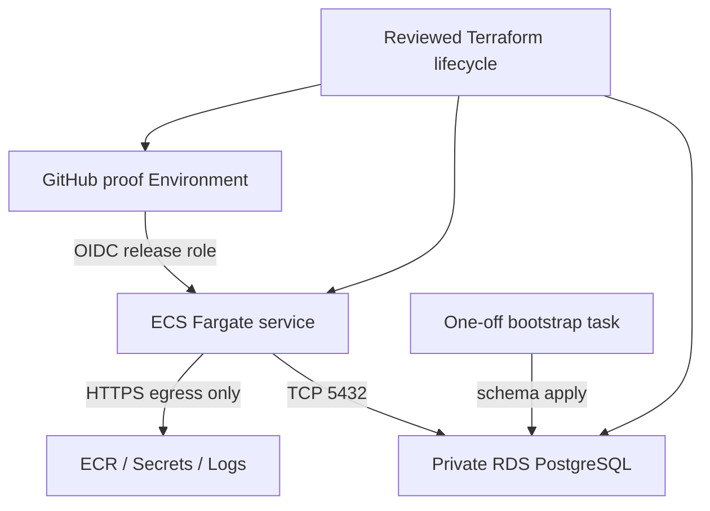

# AWS proof deployment adapter

This directory contains the first real cloud adapter for Agent Runtime Platform. It deliberately
uses AWS resources without making AWS an application authority. The Runtime still receives an OCI
image, a PostgreSQL DSN, ordinary environment configuration, HTTP networking, signals, and stdout
logs; PostgreSQL remains the authority for ownership, fencing, workflow, checkpoint, and Memory.

## Layout

| Path | Authority |
| --- | --- |
| `bootstrap/` | Private, encrypted, versioned S3 state bucket and native state lockfile settings |
| `proof/` | VPC, security groups, ECR, single-instance RDS, ECS task/service definitions, IAM, secret container, logs, and budget |
| `proof/tests/` | Credential-free mock-provider plan assertions and fail-closed negative cases |
| `scripts/offline-check.sh` | Deterministic format, provider initialization, validation, and tests with ambient AWS credentials removed |
| `adr/0001-terraform-aws-adapter.md` | Option comparison and architecture decision |

The Terraform roots are flat by concern rather than wrapped in one-resource modules. This keeps the
resource graph and provider-specific behavior visible. Reusable modules are introduced only after a
second environment or provider creates demonstrated duplication.

## Proof topology



The two Runtime subnets route to an Internet Gateway so Fargate can obtain an egress address without
a NAT Gateway. `map_public_ip_on_launch=false` remains set at the subnet; the ECS service opts in per
task. The Runtime security group has no ingress and only DNS, HTTPS, and PostgreSQL egress. The two
database subnets have no Internet route, and RDS is not publicly accessible. There is no ALB or DNS
record in this proof slice. Public IPv4 is still billable per running task; P6C must reread the
[current VPC price](https://aws.amazon.com/vpc/pricing/) and include it in the time-bounded estimate.

Two database subnets are required across distinct AZs, but the DB instance is deliberately
`multi_az=false`. This is a cost-controlled correctness proof, not an HA claim.

## Offline P6A verification

Terraform `test` mock providers use the real AWS provider schema but generate computed attributes
locally. They do not create temporary infrastructure or require an AWS account.

```bash
bash deploy/aws/scripts/offline-check.sh
pytest -q tests/test_aws_deployment_contract.py
python scripts/check_substrate_contract.py
git diff --check
```

The script removes standard AWS credential variables and disables EC2 metadata before invoking
Terraform. `init` may contact the Terraform registry to install the locked provider; validation and
mock plans do not contact an AWS endpoint. A successful mock plan must be described as an **offline
mock plan**, never as a real AWS plan.

## State bootstrap boundary

The main configuration declares `backend "s3" {}` without account coordinates. P6C first produces a
saved, reviewed plan for `bootstrap/`. Only after explicit authorization may that plan create the
state bucket. Its output supplies:

```text
bucket=<account-and-region-qualified name>
key=agent-runtime-platform/proof/terraform.tfstate
region=<approved region>
use_lockfile=true
encrypt=true
```

The bucket enables versioning, blocks all public access, enforces bucket-owner ownership, and uses
server-side encryption. `force_destroy=false` makes accidental recursive deletion fail. The small
bootstrap state is itself local and must be stored as controlled evidence until the main backend is
initialized; this unavoidable bootstrap boundary is explicit rather than hidden in a console step.

## Secret boundary

Terraform never accepts or creates a plaintext PostgreSQL DSN. RDS manages its master password in
Secrets Manager. The proof stack creates an empty `runtime-postgres-dsn` secret container and gives
the ECS execution role permission to inject only that secret. Runtime and bootstrap task roles have
no AWS permissions.

P6C must deterministically:

1. reread the private RDS endpoint and RDS-managed master-secret metadata;
2. derive a `verify-full` DSN without printing it;
3. write a new Runtime secret version through a redaction-checked bootstrap command;
4. run the one-off schema task and authoritatively reread schema versions;
5. set `runtime_secret_is_seeded=true` only after those postconditions pass.

An ECS service plan with `desired_count>0` fails while
`runtime_secret_is_seeded=false`. No `aws_secretsmanager_secret_version` resource is allowed because
its secret value would persist in Terraform state.

## Consequential P6C authorization gate

No `plan` using live provider reads, `apply`, secret write, ECS task run, database operation, or
`destroy` is authorized by this P6A code. Before any such action, the operator must approve one exact
set of inputs and consequences:

| Input | Required decision |
| --- | --- |
| AWS identity | Account ID and alias reread from the active short-lived session |
| Location | Region and two valid AZs |
| Image | Source commit, registry digest, scan result, and task-definition identity |
| Cost | Current regional estimate, account-wide monthly budget, maximum environment lifetime |
| Database | Exact PostgreSQL minor/class/storage, single-AZ limitation, backup days, deletion protection |
| RDS deletion | Whether to skip or provide a unique name and retain the final snapshot |
| Secret deletion | Immediate deletion or a 7–30 day recovery window |
| State | Backend bucket/key, retention, evidence archive, and final version cleanup |
| Teardown | Ordered command/plan, resources expected to remain, and residual-cost reread |

The real lifecycle order is deterministic:

```text
identity/region reread
-> bootstrap saved plan and approval
-> state backend initialization
-> proof saved plan, cost/IAM/destruction review, and approval
-> apply with desired_count=0
-> secret bootstrap
-> schema bootstrap and postconditions
-> Runtime tasks, readiness, and semantic smoke
-> drift/cost/evidence reread
-> proof destroy plan and approval
-> destroy and residual-resource reread
-> state evidence/archive decision
-> state-bucket cleanup plan and approval
```

## Current limitations

- No AWS API has been called and no price or regional engine availability has been asserted.
- `rds.force_ssl=1` requires encrypted transport but is not AWS evidence of CA and hostname
  verification. P6B.2 qualifies the reusable `verify-full` negative-control harness; P6C must run
  it against the selected ECR digest and RDS endpoint.
- The example digest is a placeholder. P6C must build, push, and authoritatively reread the exact
  ECR image digest before the proof plan may use it.
- The empty service has no public ingress. P6C owns ECS-local readiness and semantic probes, using
  the P6B.2 exact-image harness rather than a rebuilt or tag-only image.
- Baseline JSON logs are routed to CloudWatch; W3C/OTLP export remains pending before P7 traffic.
- GitHub OIDC and a bounded release role are described, but no CI release/apply workflow is enabled.
- Heartbeat-renewal availability risk R14 is unchanged.
