# Cloud Runtime Upgrade

Version `0.3.0` adds a self-hosted execution-management layer around the Travel application
runtime. Version `0.4.0` adds a policy-enforced subprocess backend for registered tools. Version
`0.6.0` generalizes the manager, registry, persistence, and `/runs` API across typed domains.
Version `0.7.0` adds `release-validation:1.1.0`, a static validated DAG and immutable
selective-replay child runs, while retaining `release-validation:1.0.0` for pinned fixed-order
recovery. Version `0.8.0` adds fail-closed API-key authentication and tenant-qualified
control-plane persistence. Version `0.9.0` adds a typed default-deny Viewer/Operator authorization
boundary. Platform version `1.0.0` adds the policy-governed dynamic tool loop, `1.1.0` adds
governed subject-scoped cross-thread memory with sealed run snapshots, and `1.2.0` adds
prepare-before-dispatch durable external actions with explicit uncertain-outcome recovery.

## Architecture

```mermaid
flowchart TB
    C["Client"] --> A["Bearer auth and typed RBAC"]
    A --> API["FastAPI control plane"]
    API --> RM["RuntimeManager and AgentRegistry"]
    RM --> Q["Durable Run claims + local wake signal"]
    RM --> RS[("Runs, events, checkpoints, memories")]
    RM --> DL["DynamicToolLoop"]
    RM --> DAG["Serial validated DAG"]
    DL --> P["Planner and policy gate"]
    P -->|read_only| S["Registered-tool sandbox"]
    P -->|external_write| EC["ExternalActionCoordinator"]
    EC --> E[("tool_calls and external_actions")]
    E --> H["Registered provider boundary"]
    DL --> EP["EvidenceProjector"]
    S --> RS
    E --> RS
    EP --> RS
```



Both Travel API paths use the same durable `thread_states` table. The generic
run path persists `tenant_id`, `domain_id`, and `schema_version` separately from
state JSON, and the registry validates concrete input/state models before
execution. Thread identifiers are scoped within a tenant: two tenants may reuse
the same identifier independently, while reusing it for a different domain or
schema inside one tenant fails explicitly instead of overwriting a checkpoint.

External writes never enter the subprocess sandbox. The loop delegates their
durable prepare, dispatch, retry, and recovery state machine to
`ExternalActionCoordinator`, which invokes a server-registered provider through
an injectable, configurable boundary. `EvidenceProjector` mirrors authoritative
workflow evidence into the public Run stream without changing payloads or states.
The bundled Travel provider is a deterministic SQLite test double in a separate
file, not a live travel integration.

## Authentication, authorization, and tenant boundary

`StaticApiKeyAuthenticator` loads local credential records from
`RUNTIME_API_KEYS_JSON`, hashes each plaintext key in memory, and returns an immutable
`Principal`. Each credential must declare `viewer` or `operator`; missing or unknown roles fail
configuration loading without retaining the plaintext key in the validation exception chain.
The API passes only the principal's derived `TenantContext` into
`RuntimeManager`; request models reject extra fields, so a client cannot select or override
`tenant_id` in JSON. With no configured credentials, protected endpoints fail closed.

In normal runtime mode, only `/health` and `/ready` are public. `/agents`, `/tools`, tool
execution, the synchronous compatibility endpoint, runs, cancellation, event history/SSE, and
thread checkpoints require `Authorization: Bearer <api-key>`. Missing and invalid keys share one
`401` response. Resource lookups that are unknown or owned by another tenant share one `404`
response.

`RUNTIME_DEMO_MODE=true` is an explicit local-only exception. It is mutually exclusive with
`RUNTIME_API_KEYS_JSON`, registers `/demo` plus a no-store `/demo/session` bootstrap response, and
creates one ephemeral Operator credential for that browser console. The default Compose port is
bound to `127.0.0.1`; demo mode must not be exposed as a deployment authentication mechanism.
Without the switch, those two routes are absent and the normal fail-closed behavior is unchanged.

`RoleAuthorizer` maps the trusted configured role to typed permissions. Viewers may list agents
and tools and read run state, events/SSE, and thread checkpoints. Operators receive those read
permissions plus run creation/replay, cancellation, tool execution, and the synchronous
compatibility endpoint. Operators also receive `external-actions:execute`; an external-write
Planner decision requires both ordinary tool-execution and external-action permission from the
authority snapshot persisted with the run. The deterministic dry-run/apply command is gated by the
separately typed `quarantine:resolve` permission, which the current two-role mapping grants to every
Operator; it is not part of asynchronous Run execution authority. Same-tenant permission failures
return `403` at the
API boundary or a stable policy-denial code inside an already submitted run; provider mutation is
not attempted.

Tenant filters are enforced again in `SQLiteRunStore`, not only at the route layer. Runs,
idempotency lookup, cancellation, events, checkpoints, tool-to-run linkage, and selective
replay sources are tenant-qualified. Existing pre-0.8 SQLite rows migrate to the reserved
`legacy` tenant without changing their domain/schema state or event history; operators must
explicitly map a credential to `legacy` if those rows should remain accessible.

This slice intentionally stops at two static roles. It does not implement custom roles,
user/role persistence, resource-specific grants, per-Agent/per-tool grants, quotas, key rotation,
or an external secret provider.

## Run lifecycle

```text
queued -> running -> completed
                  -> failed
queued/running    -> cancelled
```

Every run records its stable `run_id`, authenticated tenant, thread, pinned Agent version,
domain/schema identity, structured input/output, timestamps, validation
results, cancellation metadata, optional `client_request_id`, and latest
serialized domain state.

Important transitions are append-only events:

```text
run.queued
run.started
run.recovered
checkpoint.loaded
checkpoint.saved
run.completed | run.failed | run.cancelled
sandbox.execution_started
sandbox.execution_finished
external_action.prepared
external_action.dispatch_started
external_action.succeeded | external_action.failed | external_action.outcome_unknown
```

The `external_action.*` sequence applies only to registered `EXTERNAL_WRITE`
steps. Public action evidence carries the configured provider name, dispatch
count, status, and successful provider reference, but never the server-derived
idempotency key, credentials, permission snapshot, or raw provider errors.

The workflow action/tool ledger is committed before its `run_events` mirror. A
provider success receives up to two complete mirror attempts. If neither can
publish the succeeded action and matching tool result, the action remains
durably `succeeded`, but the run fails with
`external_action_evidence_incomplete`. The provider is not called again merely
to repair evidence.

Each prepared write also binds a stable `provider_identity`. This is an
explicit, non-sensitive deployment/account identifier, distinct from the
logical route, URL, and credentials. It is stored internally for recovery but
is not a substitute for authentication or a reason to expose provider secrets
in run evidence.

## Submission idempotency

Clients may send a `client_request_id` when creating a run. The database applies a unique constraint to `(tenant_id, client_request_id)`. Repeating the same submission returns the existing run for that tenant instead of creating another queued task; another tenant may independently use the same key.

This protects the control API from duplicate runs caused by HTTP retries. It is
separate from external-action idempotency. Phase 7A derives a stable, internal
key from the tenant/run/workflow/step/tool/input identity and stores it in the
`external_actions` ledger before provider dispatch. A
`PROVIDER_IDEMPOTENT` adapter must declare that it supports the same key; the
Travel test double proves provider-side deduplication in a separate SQLite file.

## Cancellation race handling

Cancellation remains cooperative because an in-process Agent step cannot be forcibly interrupted safely. However, cancellation state is not protected only by a read-then-write sequence:

1. `request_cancel` sets `cancel_requested = 1` directly in the database;
2. final completion uses a conditional update with `WHERE cancel_requested = 0`;
3. if the condition fails, the run is finalized as cancelled and no thread checkpoint is committed.

This closes the boundary race where a stale `RunRecord` could overwrite a cancel request.

Phase 7A adds a narrower cancellation/dispatch arbitration. The
`prepared -> dispatching` update reads `runs.status` and `cancel_requested` in
the same SQLite `BEGIN IMMEDIATE` transaction. If cancellation commits first,
the action remains prepared, no dispatch event is written, and provider code is
not entered.

Once provider dispatch starts, cancellation cannot retract it. A successful
action may therefore outlive a later run cancellation at the final completion
compare-and-set. Its terminal action row and provider reference remain durable,
while the cancelled run does not commit a thread checkpoint. Phase 7A performs
no compensation. An `external_action_outcome_unknown` failure is not masked by
concurrent cancellation because hiding uncertainty would invite an unsafe
retry. `external_action_evidence_incomplete` is also not masked: a later cancel
cannot erase the fact that the provider succeeded while public run evidence
remained incomplete.

## Atomic lifecycle and execution ownership

The `runs` table is the worker source of truth. `submit()` atomically creates the Run and
`run.queued`; a local event only reduces polling latency. Claim and takeover atomically rotate an
opaque lease token, increment `attempt`, set a store-time expiry, and append `run.started` plus
`run.recovered` when applicable. Completion, failure, running cancellation, checkpoint persistence,
and their describing events commit under that same current unexpired token.

Claim arbitration is also tenant/thread-qualified. A queued Run cannot become `running` while a
different Run for the same `(tenant_id, thread_id)` remains `running`; an expired predecessor must
be recovered and terminalized before its successor starts. The first claim captures the current
checkpoint revision, and successful state-bearing completion advances that revision with a
conditional write in the same transaction as `checkpoint.saved` and `run.completed`. Different thread keys remain
eligible for parallel workers. See
[`thread-execution-serialization.md`](thread-execution-serialization.md).

Heartbeats renew from current SQLite time, not from a worker clock or the old deadline. At
`store_now == lease_expires_at` the attempt is expired: it cannot renew or commit, and a different
Manager may claim it with a new token. The token is also checked in the workflow, memory, evidence,
and new external-dispatch mutation transactions, so a paused old worker cannot overwrite the newer
attempt after takeover. Provider responses from an already-authorized dispatch remain governed by
their dispatch and tool-attempt tokens because rejecting valid provider evidence would not undo the
external effect.

Lease owner, token, heartbeat, and deadline are internal fields and never enter public Run JSON,
Planner context, tool arguments, events, memory values, or provider requests. The complete model and
race matrix are in [`durable-run-leasing.md`](durable-run-leasing.md).
The checkpoint base revision is also excluded from public Run JSON, but revision numbers are
non-secret audit metadata and appear in `run.started`, `checkpoint.loaded`, and
`checkpoint.saved` events.

## Tool sandbox

The process backend executes only tools registered by the server. Clients cannot submit Python source, shell commands, executable paths, or module names.

The boundary applies:

- a server-side tool allowlist;
- Pydantic input validation with unknown fields rejected;
- a fixed Python executable and fixed worker script;
- a fresh temporary working directory per execution;
- a restricted-by-default environment that does not forward API keys or database credentials;
- wall-clock timeout with process-group termination on POSIX;
- stdout/stderr size caps;
- POSIX CPU, address-space, open-file, and core-dump limits;
- structured execution results and optional linkage to a durable `run_id` event history.

The pinned `travel-agent:1.0.0` and `1.1.0` loops each use a separate registry
containing three deterministic read-only tools:

```text
search_trip_options
route_cost_summary
rank_trip_options
```

`travel-agent:1.2.0` uses a different registry that adds
`create_trip_hold`. That tool is server-classified as
`ToolEffect.EXTERNAL_WRITE` with
`ToolRetryMode.PROVIDER_IDEMPOTENT`; it has no sandbox handler and instead names
the registered `travel-trip-hold` provider. The old registries and input
schemas remain unchanged.

The four-tool registry is private to the `1.2.0` durable loop. `GET /tools` and
the direct `ToolSandbox` retain the published three-tool read-only catalog.

Example:

```bash
curl -H "Authorization: Bearer $RUNTIME_API_KEY" http://127.0.0.1:8000/tools

curl -X POST http://127.0.0.1:8000/tools/route_cost_summary/execute \
  -H "Authorization: Bearer $RUNTIME_API_KEY" \
  -H "Content-Type: application/json" \
  -d '{
    "run_id": null,
    "arguments": {
      "transport_cost": 2000,
      "hotel_cost": 3000,
      "activity_cost": 1000,
      "budget": 7000
    }
  }'
```

Capability declaration and enforcement are separate. Every `ToolPolicy` declares a mode and
required enforcement strength for filesystem, network, and environment access. Before starting a
worker, `ToolSandbox` checks the declaration against the subprocess executor's support matrix; an
unsupported requirement returns `capability_unsupported` without starting the handler.

| Capability | Modes | Default | Process enforcement and current support |
| --- | --- | --- | --- |
| Filesystem | `none`, `readonly`, `readwrite` | `readwrite` | Only `readwrite` is supported. It means the runtime OS user's existing host access with a fresh temporary working directory; there is no mount boundary. `none` and `readonly` fail closed. |
| Network | `none`, `host` | `host` | Both modes are supported. `none` installs a Python socket guard before importing the registered handler; `host` preserves the existing behavior and explicitly leaves host networking available. |
| Environment | `restricted`, `inherited` | `restricted` | Both modes are enforced by the environment passed to the worker. `restricted` includes only runtime-owned control variables and a small OS allowlist; `inherited` explicitly exposes the parent environment to the handler. The worker ignores interpreter-control variables such as `PYTHONPATH`, so they cannot redirect registered handler imports. |

The worker also suppresses unsafe implicit script paths while preserving normal system,
virtual-environment, and user-site package discovery. Registered handler modules must therefore
be importable from the repository root or one of those normal interpreter package paths. The
worker explicitly selects Python UTF-8 mode so its stderr contract does not depend on the host
locale.

The subprocess executor supports only `enforcement="process"`. Any capability requiring
`enforcement="kernel"` fails closed. Process network prevention is deliberately narrower than
kernel isolation: it protects trusted, first-party Python handlers from accidental policy
violations, but hostile code using lower-level/native modules or child processes could bypass it.
The sandbox also has no private mount namespace and cannot prevent a malicious registered tool
from reading files available to the runtime user. Registered tools therefore remain trusted
application code.

The dynamic Agent loop invokes this sandbox for allowed `READ_ONLY` decisions.
The direct tool endpoint remains available for registered read-only tools, but
an authorized `POST /tools/create_trip_hold/execute` returns `409`; missing
external-action permission returns `403`. External writes must pass through the
run lifecycle, permission checks, prepared action ledger, cancellation
arbitration, and provider recovery policy.

A production backend for untrusted code or third-party MCP servers should replace the subprocess implementation with an ephemeral container, Kubernetes Job, gVisor sandbox, Firecracker microVM, or equivalent isolation boundary using:

```text
read-only root filesystem
+ explicit writable workspace
+ no host mounts
+ dropped Linux capabilities
+ seccomp/AppArmor profile
+ network disabled or allowlisted
+ non-root UID
+ CPU/memory/PID limits
+ execution deadline
+ image and dependency allowlist
```

## External-action provider boundary

`ExternalActionProviderRegistry` is a server-owned dependency-injection
boundary. The Planner supplies only arguments that already passed the tool
schema; deployment configuration selects the provider and its credentials. A
configurable HTTP adapter can be injected at this boundary by setting
`RUNTIME_TRAVEL_ACTION_PROVIDER_URL` and the required non-sensitive
`RUNTIME_TRAVEL_ACTION_PROVIDER_IDENTITY`; an optional
`RUNTIME_TRAVEL_ACTION_PROVIDER_BEARER_TOKEN` supplies server-owned
authentication. The HTTP adapter defaults to `supports_idempotency=false`.
Because the Travel action requires provider idempotency, deployment must set
`RUNTIME_TRAVEL_ACTION_PROVIDER_SUPPORTS_IDEMPOTENCY=true` only after verifying
the endpoint's actual guarantee; otherwise policy fails closed before action
preparation or dispatch. Sending an `Idempotency-Key` header alone is not proof
that an arbitrary endpoint honors it. With no URL, the default remains the
SQLite test double. Phase
7A does not claim that any live airline, hotel, booking, inventory, or payment
provider has been validated.

The HTTP adapter sends the normalized action request as JSON with the stable
`Idempotency-Key` header and optional Bearer token. It disables redirects and
environment proxy discovery, bounds response size, requires a typed JSON
success body, and exposes only sanitized definitive/ambiguous failures. The URL
and token are configuration, never Planner input or public run evidence.

HTTPS is the default and the only production transport. Every non-loopback `http://`
endpoint is rejected, regardless of whether Bearer authentication is present.
Loopback HTTP is accepted only for explicit development when
`RUNTIME_TRAVEL_ACTION_PROVIDER_ALLOW_INSECURE_LOCALHOST=true` is set, and the
flag is required even without a Bearer token. It never permits plaintext
dispatch to a remote host.

Only `200` and `201` are eligible for synchronous HTTP success, subject to the
bounded typed-body and output-model checks; every other status is ambiguous by
default. The adapter has a server-only `definitive_status_codes` constructor
option for a small, explicitly verified set of `4xx` statuses whose provider
contract guarantees no effect. The API exposes no environment setting for this
option, so the configured provider defaults to an empty set.

The default `travel-trip-hold` registration uses
`SQLiteTripHoldProvider`. Its provider-side ledger is stored in a separate file
from the runtime database. Same idempotency key plus the same canonical payload
returns the same deterministic `hold_...` reference; key reuse with a different
payload is a definitive conflict. The same file owns a stable UUID provider
identity; a different file is a different provider identity. This is a local
test double, not an official vendor sandbox.

The runtime-side `external_actions` table persists intent before dispatch and
tracks `prepared`, `dispatching`, `succeeded`, `failed`, or
`outcome_unknown`. `PROVIDER_IDEMPOTENT` recovery reuses the server-derived
key with a maximum of two total dispatches. An `UNSAFE` call interrupted while
dispatching becomes `outcome_unknown` without a blind retry. The runtime stores
the sanitized provider reference and commits a successful action/result with
its parent tool-call result in one transaction.

Every external-write `ToolSpec` must declare a Pydantic `output_model` with
`extra="forbid"`. The loop adds the trusted top-level provider reference,
validates and normalizes the result, and persists only fields allowed by that
model. For a Travel hold, validation before the succeeded ledger transaction
also requires the result to match the prepared destination, selected option
name, quoted total, and hold duration, with an opaque `hold_` reference.
Provider-added extra, debug, or secret fields, mismatched results, and raw HTTP
bodies cannot enter the action/tool result or public evidence.

These mechanics make uncertainty visible and bound duplicate risk; they do not
create an exactly-once guarantee. See
[`durable-external-actions.md`](durable-external-actions.md).

## Descendant process cleanup

A registered tool may eventually launch its own subprocesses. When a timed-out sandbox process group is killed, those descendants can be reparented to container PID 1. The production image therefore starts the service through `tini`, which forwards signals and reaps orphaned descendants instead of leaving zombie processes behind.

This guarantee applies to the supplied Docker image. Running `uvicorn` directly on a host still relies on that host's init or service manager to reap orphaned descendants.

## Restart recovery

Workers continuously poll durable claim candidates. Queued Runs are fresh claims; a `running` Run
is recoverable only when its lease is expired and it already carries the checkpoint base revision
captured by its first thread-aware claim. A live unexpired lease is not rewritten when another
Manager starts. Every takeover rotates the token, preserves the base revision, increments the
attempt, and appends `run.recovered` and `run.started` in the claim transaction. Pre-thread-
serialization nonterminal rows must be drained with the old binary before migration; the Runtime
does not guess which checkpoint an already-running legacy attempt originally read.

Recovered executions carry a domain-neutral execution-context marker; the release-validation
adapter maps it to explicit interrupted-step recovery, while normal submissions do not receive it.
The dynamic loop replays the pinned Planner decision and inspects any linked external action:
success is reused, a provider-idempotent in-flight dispatch may use its remaining bounded retry
with the same key, and an unsafe in-flight dispatch becomes `outcome_unknown` without another
provider call. If thread-state/workflow identity, the registered tool effect/schema,
persisted permission, provider route/identity/capability, or other dispatch binding has
drifted, recovery performs no blind provider replay. An in-flight dispatched
action is finalized/reported as `outcome_unknown`; a ledger-proven success stays
succeeded and uses `external_action_evidence_incomplete` when its public evidence
cannot be reconciled. Terminal `failed` runs remain excluded from recovery.

The full suite verifies recovery, cancellation before start, cancellation at execution and
dispatch boundaries, same-thread execution serialization, cross-thread parallel execution,
checkpoint revision conflicts, tenant-scoped thread state and submission idempotency,
fail-closed authentication, Viewer/Operator authorization and spoof resistance, cross-tenant
resource invisibility, DAG validation, tenant-safe selective replay, source-run immutability, tool
allowlisting, schema rejection, timeout termination, environment scrubbing, external-action
ledger transitions, provider-side deduplication, uncertain outcomes, and REST/SSE evidence
equality, including provider-identity drift, output allowlisting, transport
security, post-dispatch drift, and unrecoverable evidence-mirror gaps.

## Deliberate limitations

SQLite, durable polling, and an in-process wake signal keep the repository runnable without external services. The
supplied Compose configuration is the loopback-only local demo. A normal container invocation
remains fail-closed and requires configured credentials. The Kubernetes Deployment reads
`RUNTIME_API_KEYS_JSON` from Secret `travel-agent-runtime-auth` / `api-keys.json`; provisioning and
rotation of that Secret are intentionally outside this slice. Therefore:

- deploy one runtime replica only;
- Run leasing and fencing are proven only for Managers sharing one local SQLite database, not for
  multi-host workers or a distributed database;
- cancellation occurs at cooperative execution boundaries;
- authentication and two-role authorization use local static API-key configuration; there is no
  custom role model, per-tool grant, quota, key rotation, or external secret-manager integration;
- the only bundled external-write reference is a synthetic SQLite trip-hold test double; there is
  no live booking, payment, or inventory integration and no claim of an official vendor sandbox;
- there is no exactly-once guarantee, compensation/rollback workflow, human approval, or
  automated reconciliation for `outcome_unknown` actions;
- external dispatch has no distributed queue and remains single-replica SQLite coordination;
- the subprocess sandbox does not isolate host networking or the complete host filesystem;
- POSIX rlimits are not available on Windows, where timeout and process separation remain but resource enforcement is weaker;
- there is no arbitrary user-code execution endpoint;
- descendant reaping depends on `tini` in the provided container image or an equivalent host init/service manager.

A production-oriented next step is PostgreSQL for runs/checkpoints/events/memories/actions while
preserving the existing lease-token predicates, Redis or Pub/Sub as a wake channel,
provider-specific reconciliation and compensation, OpenTelemetry traces, and a container-backed
sandbox implementation.

The first lease-aware rollout must stop and verify all pre-leasing Runtime processes before the
additive migration, then start only lease-aware binaries. Mixed old/new execution and mixed-version
rollback are unsupported because old Managers ignore lease columns.

The first thread-serialization rollout must additionally drain all queued and running Runs before
the new columns and partial unique index are installed. Existing checkpoint rows migrate to
revision `1`; absence remains logical revision `0`. Old binaries do not maintain revisions, so
mixed-version execution and rollback across this migration are unsupported. In particular, an old
state-only writer does not increment `revision` and is therefore invisible to CAS; stop-and-drain
remains mandatory even if a partial rollout already added the new columns.
