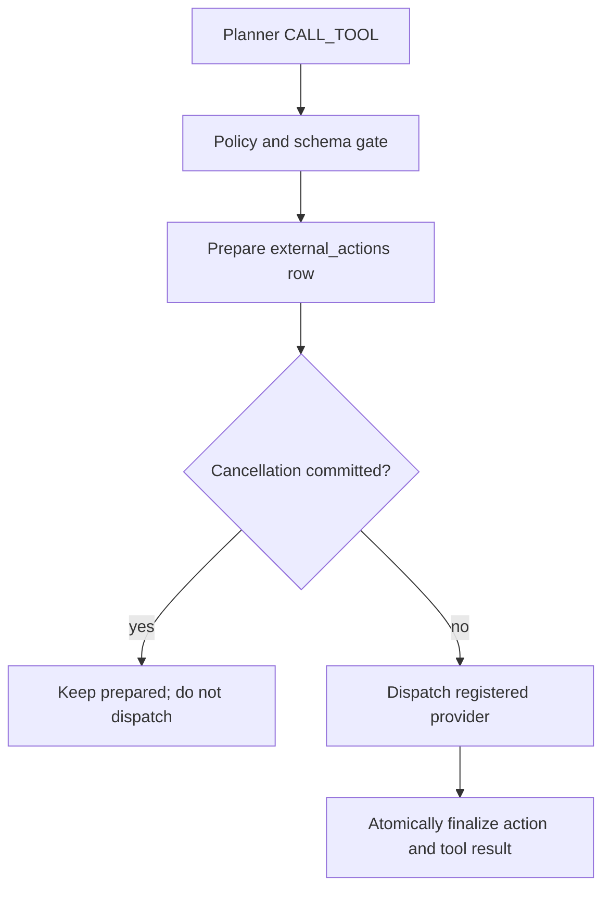

# Durable external actions

Phase 7A adds a generic, opt-in path for tools that change state outside the runtime. The
reference slice is `travel-agent:1.2.0`: it can create a synthetic temporary trip hold only when
the caller explicitly submits `requested_action="create_hold"`. Omitting the field, or setting it
to `plan_only`, preserves the planning-only behavior.

The implementation makes external intent, dispatch attempts, and outcomes durable. It does not
claim exactly-once execution, automatic compensation, human approval, or integration with live
booking, payment, or inventory systems.

## Version and tool boundary

Published runtime versions keep separate contracts:

| Version | Input contract | Tool registry | Memory behavior |
| --- | --- | --- | --- |
| `travel-agent:1.0.0` | `TravelMessageInput` | Its own three-tool synthetic read-only registry | Memory-free Phase 5A behavior |
| `travel-agent:1.1.0` | `TravelMessageInput` | A separate three-tool read-only registry | Phase 6A sealed governed memory |
| `travel-agent:1.2.0` | `TravelExternalActionInput` with `requested_action` defaulting to `plan_only` | A separate registry containing the same three tools plus `create_trip_hold` | The same sealed governed memory as `1.1.0` |

The old input model and old registries are not mutated. Public `GET /tools` and the direct
sandbox keep the existing three-tool read-only catalog. `create_trip_hold` exists only in the
private, version-pinned `1.2.0` durable registry; the direct POST route recognizes it solely to
return `409` rather than allowing a ledger bypass.

The four-tool registry is a runtime policy and dispatch registry, not the base Planner's tool
menu. `DurableActionTravelPlanner` removes `create_trip_hold` from every context passed to the
base/model Planner, which therefore receives only the three read-only tool descriptors.

`ToolSpec` has two server-owned classifications:

- `ToolEffect.READ_ONLY` executes a registered handler in the subprocess sandbox and must use
  `ToolRetryMode.SAFE`.
- `ToolEffect.EXTERNAL_WRITE` has no sandbox handler. It names a registered provider and is
  dispatched only through the durable external-action path. Every external-write registration
  also supplies a server-owned Pydantic `output_model` configured with `extra="forbid"`; only its
  normalized fields may become durable or public results.

`ToolRetryMode` defines recovery behavior as `SAFE`, `PROVIDER_IDEMPOTENT`, or `UNSAFE`. The
Travel hold declares `PROVIDER_IDEMPOTENT`; the runtime verifies the provider's idempotency
capability before preparing or dispatching the action.

The `create_trip_hold` `ToolSpec` also declares a server-only `runtime_input_gate` that accepts
only `requested_action="create_hold"`. It is independent of the wrapper's filtered Planner
context and cannot be selected or weakened by a Planner or request-supplied tool descriptor.

## Prepare-before-dispatch protocol



For an allowed external write, the loop:

1. validates the step limit, runtime allowlist, persisted permissions, server-owned runtime-input
   gate, provider configuration, stable provider identity, provider idempotency capability when
   required, and typed arguments;
2. claims the durable tool step;
3. creates or verifies one `external_actions` row for `(run_id, step_id)` before provider code is
   entered;
4. derives a stable idempotency key on the server from tenant, run, workflow, step, tool, and
   normalized-input identity;
5. atomically arbitrates cancellation and the `prepared -> dispatching` transition;
6. invokes the server-registered provider with the durable action identity and normalized
   arguments;
7. atomically writes the terminal action state and its parent tool result.

The Planner and request body cannot choose a provider, executable, handler module, or
idempotency key. The key is stored in the internal ledger and sent to the provider, but is not
included in public run events.

The runtime-input gate runs before either the durable tool step or action row is claimed. If a
`plan_only` run reaches `CALL_TOOL create_trip_hold`, including through a forged decision already
persisted for replay, policy fails with `external_action_not_requested`; no step/action row is
created and the provider dispatch count remains zero.

## Durable ledger and evidence

`external_actions` is linked to its parent `tool_calls` row and records:

- action, run, step, tenant, subject, workflow, tool, logical provider route, and concrete
  provider identity;
- canonical arguments and input hash;
- retry mode and the unique server-derived idempotency key;
- dispatch count and current dispatch token;
- `prepared`, `dispatching`, `succeeded`, `failed`, or `outcome_unknown` status;
- the sanitized provider reference and result, or a stable error code.

The dispatch token fences stale workers. A successful provider result is committed to
`external_actions.result_json` and `tool_calls.result_json` with the same decoded object
semantics in one transaction. A terminal action/result binding is then reused as a cached tool
observation during recovery.

REST and SSE expose the same durable action events:

```text
external_action.prepared
external_action.dispatch_started
external_action.succeeded | external_action.failed | external_action.outcome_unknown
```

Events identify the action, step, tool, configured provider, dispatch count, stable status, and,
on success, the provider reference. They exclude the idempotency key, provider credentials,
persisted permission snapshot, and raw provider error details.

`provider_name` is a logical server route such as `travel-trip-hold`.
`provider_identity` is a different value: a stable, explicit, non-sensitive identifier for the
concrete deployment/account behind that route. It is stored in the internal action identity so
credential rotation can retain continuity, while switching account or provider deployment cannot
silently reuse an in-flight action. It must never be a Bearer token, API key, endpoint with
embedded credentials, or other secret.

Provider success is not persisted verbatim. The dispatcher combines the trusted top-level
`provider_reference` with the provider result, validates it through the external-write tool's
`output_model` (`extra="forbid"`), and serializes only that normalized model. Undeclared provider
fields, including accidental secret/debug fields, cannot enter `external_actions.result_json`,
the parent tool result, Travel state, or public evidence. For `create_trip_hold`, validation also
binds destination, selected option name, quoted total, and hold duration to the exact prepared
arguments, and requires an opaque provider reference matching
`hold_[A-Za-z0-9_-]{1,128}`. These checks complete before the succeeded ledger transaction. An
invalid or mismatched post-dispatch result remains ambiguous and follows the registered
bounded-retry/`outcome_unknown` policy; its raw body is not stored.

The workflow ledger is authoritative before its public `run_events` mirror. After provider
success, the loop makes up to two complete attempts to mirror both the succeeded action event and
matching tool result. If both fail, it raises `external_action_evidence_incomplete`: the action and
parent tool call remain durably `succeeded`/`completed`, the provider is not invoked again, and the
run is failed so operators cannot mistake incomplete public evidence for a fully reconciled run.

## Recovery semantics

An external call can cross a process-crash boundary, so recovery is controlled by the persisted
action state and registered retry mode:

| Durable state | Recovery behavior |
| --- | --- |
| `prepared` | The provider has not been entered. Recovery may perform the first dispatch after cancellation arbitration. |
| `dispatching` + `PROVIDER_IDEMPOTENT` | Re-dispatch with the same idempotency key, rotating the dispatch token. The loop permits at most two total dispatches. |
| `dispatching` + `SAFE` | The declared-safe operation follows the same bounded two-dispatch recovery budget. |
| `dispatching` + `UNSAFE` | Do not retry blindly; finalize `outcome_unknown`. |
| `succeeded` | Reuse the persisted result and provider reference; do not call the provider again. |
| `failed` | Preserve the definitive failure; do not silently retry it. |
| `outcome_unknown` | Preserve the uncertainty as `external_action_outcome_unknown`; do not convert it to success, ordinary failure, or cancellation. |

If the local transaction that should finalize an uncertain action cannot be
proven committed, the runtime does not mark the Workflow or Run terminal while
the action is still `dispatching`. The Run remains `running` as a
crash-equivalent recovery candidate with a non-terminal reconciliation marker;
the next process start re-enters the same fenced recovery path, even if a
cancellation was requested meanwhile. Phase 7A does not include a continuously running
reconciliation scanner, so this rare local persistence outage requires a
runtime restart to make progress.

Recovery also checks the persisted dispatch against the current execution boundary. Once
`dispatch_count > 0`, drift in thread-state/workflow identity, the server-owned runtime-input
gate, registered tool effect or input schema, persisted permission, provider
route/configuration/availability/identity, or declared idempotency capability cannot become a
normal not-requested, `unknown_tool`, permission, configuration, or schema failure. For an
in-flight/uncertain dispatched action, the runtime does not call the provider again and
finalizes/reports `external_action_outcome_unknown`. If the ledger already proves success, that
success is preserved and an unreconcilable public-evidence gap is reported as
`external_action_evidence_incomplete`; a terminal definitive failure remains
`external_action_failed`.

An unclassified exception or invalid response after provider entry is ambiguous: the action may
already have happened. Provider-idempotent actions may consume the remaining bounded retry with
the same key. Once that budget is exhausted, the result is `outcome_unknown`. Unsafe actions
become unknown immediately and are never blindly retried.

This is bounded re-dispatch with provider-assisted deduplication where declared. It is not an
exactly-once guarantee.

## Cancellation semantics

Cancellation and initial dispatch use one SQLite `BEGIN IMMEDIATE` arbitration. If the cancel
request commits first, the action remains `prepared`, no `dispatch_started` event is emitted, and
provider code is not called.

Cancellation remains cooperative after dispatch starts. A provider call cannot be forcibly
retracted, so an action may reach `succeeded` before a later run-completion compare-and-set sees a
cancel request and marks the run `cancelled`. The action ledger and provider reference remain the
truth about the already completed external effect; no thread checkpoint is committed for that
cancelled run. Likewise, an `outcome_unknown` action is not hidden by concurrent cancellation.
Nor can cancellation mask `external_action_evidence_incomplete`: in that case the provider action
remains `succeeded`, but the run ends `failed` because both public-evidence mirror attempts failed.

Phase 7A has no compensation workflow. Cancelling a run does not release, reverse, or otherwise
undo a successful action.

## Travel reference action

`DurableActionTravelPlanner` wraps the configured base Planner and calls it with a copied context
whose tool list excludes `create_trip_hold`. For `plan_only`, the wrapper preserves valid
read-only planning decisions, but rejects a base/model Planner that fabricates
`CALL_TOOL create_trip_hold` despite that filtered contract. For explicit
`requested_action="create_hold"`, non-finish read-only decisions still pass through. Only when the
base would `FINISH` does the wrapper rebuild and validate the selected Travel plan against current
state and persisted search, ranking, and cost evidence. Only this wrapper, after a valid,
within-budget deterministic result, can insert `CALL_TOOL create_trip_hold`. After a matching
successful hold observation exists, it returns the original base `FINISH` decision.

`DurableActionTravelRuntime` also requires that matching succeeded observation during final
evaluation and adds the sanitized provider reference to the output. `plan_only` delegates to the
base behavior without preparing an action.

The tool names the logical server-owned provider route `travel-trip-hold`. By default that route
is bound to `SQLiteTripHoldProvider`, a deterministic test double with its own provider-side
SQLite file, separate from the runtime ledger. The same idempotency key and canonical payload
return the same deterministic `hold_...` reference; reusing a key with different arguments is a
definitive conflict. The provider file also stores one stable UUID `provider_identity`: reopening
the same file preserves it, while a different provider file receives a different identity. It has
no production failure-injection markers.

That provider does not contact an airline, hotel, booking platform, payment processor, inventory
service, or official vendor sandbox. Its “hold” exists only in the local synthetic provider
ledger.

A deployment can instead bind the same logical route to the configurable
`HttpExternalActionProvider` by setting `RUNTIME_TRAVEL_ACTION_PROVIDER_URL` and the required
non-secret `RUNTIME_TRAVEL_ACTION_PROVIDER_IDENTITY`; the optional
`RUNTIME_TRAVEL_ACTION_PROVIDER_BEARER_TOKEN` remains server-owned. The adapter sends a
JSON-over-HTTP `POST`, includes the stable key in `Idempotency-Key`, does not follow redirects or
use proxy settings from the process environment, requires a bounded JSON success response, and
sanitizes transport/upstream failures into definitive or ambiguous runtime classifications. This
is an injectable transport boundary, not evidence that any real Travel provider has been tested.

The HTTP adapter declares `supports_idempotency=false` by default. Because `create_trip_hold`
requires `PROVIDER_IDEMPOTENT`, the preflight gate creates no tool/action row and performs no
dispatch unless deployment configuration explicitly sets
`RUNTIME_TRAVEL_ACTION_PROVIDER_SUPPORTS_IDEMPOTENCY=true`. Operators must set that flag only for
an endpoint whose contract actually honors the stable key; the presence of the header by itself
does not establish idempotency.

HTTPS is the default and the only production transport. The adapter rejects every non-loopback `http://`
endpoint, regardless of whether Bearer authentication is configured. Loopback HTTP is available
only for explicit development when
`RUNTIME_TRAVEL_ACTION_PROVIDER_ALLOW_INSECURE_LOCALHOST=true`; the flag is required even without
a Bearer token and never permits plaintext dispatch to a remote host. The provider identity
remains required and must describe the same deployment/account across restarts and token
rotation.

Only `200` and `201` are eligible for synchronous HTTP success, and the bounded response body
must still decode and pass the registered output model. Every other status is ambiguous by
default. A provider may receive a server-only `definitive_status_codes` constructor option for a
small, explicitly verified set of `4xx` statuses whose provider contract guarantees that no
effect occurred. The public API exposes no environment variable for this option, and its default
is the empty set.

## API boundary

- Create actions only through `POST /runs` with pinned `travel-agent:1.2.0` and explicit
  `requested_action="create_hold"`.
- An authorized `POST /tools/create_trip_hold/execute` returns `409`; missing
  external-action permission returns `403`. Neither path can bypass preparation, cancellation
  arbitration, the action ledger, or recovery policy.
- Operators need both normal run/tool execution authority and `external-actions:execute` in the
  persisted run authority. Viewer and missing-action permissions fail closed.
- Selective replay rejects external-action evidence; it is not copied as if it were a read-only
  result.

## Deliberate non-goals

Phase 7A does not provide:

- exactly-once execution across the runtime and provider;
- automatic compensation, release, refund, or rollback;
- human approval or a four-eyes workflow;
- live booking, payment, inventory, or an official vendor sandbox;
- distributed dispatch, leases, or multi-replica SQLite coordination;
- arbitrary user-selected providers or untrusted provider code.

Production adapters must define provider-specific authentication, observability, reconciliation,
timeouts, rate limits, idempotency guarantees, and compensation or approval policy appropriate to
the action's consequences.
