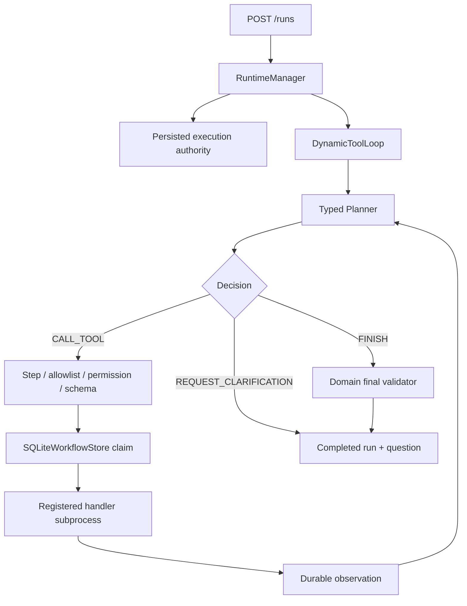

# Policy-Governed Dynamic Tool Loop

Phase 5A adds a domain-neutral Planner → Tool → Observation loop to the durable
runtime. Travel is the first runnable reference adapter; tool-loop policy and
recovery code do not import Travel or release-validation modules.

## Runtime shape



`DynamicToolLoop` sees JSON state, registered tool descriptors, observations,
and a domain callback that validates `FINISH`. It does not parse destinations,
budgets, release manifests, or any other domain field.

## Typed decisions

Planner output is a strict discriminated union. Unknown fields are rejected.

- `CALL_TOOL`: registered tool name, JSON arguments, and a bounded reason.
- `REQUEST_CLARIFICATION`: one question and reason.
- `FINISH`: a message, domain payload, and reason.

The default `ScriptedTravelPlanner` is stateless and deterministic. It derives
each call from the current observation:

1. parse structured Travel constraints in the Travel adapter;
2. call `search_trip_options`;
3. pass the returned options into `rank_trip_options`;
4. pass the actual ranking winner's cost components into
   `route_cost_summary`;
5. finish only when `within_budget` is true, otherwise ask whether the user
   wants to raise the budget or relax a preference.

This is not a fixed DAG disguised as planning: changing a search or ranking
result changes the next tool arguments, and the cost result selects the final
branch.

## Policy order and failures

Every `CALL_TOOL` is checked before a workflow step is claimed or a subprocess
is started, in this order:

1. tool-call step limit;
2. tool exists in this runtime's server-owned registry;
3. persisted execution authority includes `tools:execute`;
4. arguments validate against the tool's Pydantic schema.

The run exposes a stable `error_code` when the runtime fails:

| Error code | Meaning |
| --- | --- |
| `unknown_tool` | Planner selected a tool outside the allowlist. |
| `invalid_tool_arguments` | Arguments failed the registered schema. |
| `tool_permission_denied` | Persisted authority lacks tool execution permission. |
| `tool_timed_out` | The registered subprocess exceeded its deadline. |
| `tool_execution_failed` | A registered handler or executor failed. |
| `step_limit_exceeded` | Planner requested another tool after the bounded limit. |
| `invalid_planner_decision` | Planner/provider output or durable decision identity was invalid. |
| `planner_provider_failed` | The configured planner provider could not return a response. |

Policy denial tests assert that no sandbox call and no `tool_calls` row occurs.
Domain validation is different from runtime failure: a structurally valid
`FINISH` that violates Travel evidence or a hard constraint produces a
completed run with `current_stage="blocked"` and `validation_errors`.

## Durable evidence and recovery

Phase 5A reuses both SQLite stores:

- `workflow_executions`, `tool_calls`, and `workflow_events` form the internal
  execution ledger;
- `run_events` is the user-visible trace returned by REST and SSE.

Each decision has a stable index and evidence id. Dynamic tool steps use
`call-0001`, `call-0002`, and so on. The workflow ledger is written before its
run-event mirror; startup recovery backfills a missing mirror if a process
stopped between those commits.

The visible sequence is:

```text
planner.decision
policy.decision
tool.result
... next planner decision ...
loop.outcome
```

On restart, a persisted Planner decision is replayed instead of asking a model
to make a different decision for the same index. Completed tool results rebuild
observations without rerunning the subprocess. A `RUNNING` tool step is marked
interrupted only at an explicit manager restart boundary and then receives a
new attempt token. A real persisted tool failure is not silently retried.

The API snapshots the authenticated subject, tenant, and server-evaluated
effective permissions into an internal `execution_authority_json` field when
the run is first created. Workers and restart recovery use that snapshot; they
do not trust request fields or recalculate permissions from a later role
configuration. Idempotent resubmission does not replace the first authority.

## Travel reference behavior

`travel-agent:1.0.0` is an explicit opt-in version. The default version remains
`0.3.0`; `0.5.0` and both release-validation versions keep their existing
behavior.

Travel owns:

- natural-language constraint extraction;
- synthetic tool schemas, registries, and handler entrypoints;
- scripted planner instructions;
- final payload mapping and deterministic `TravelValidator` gate.

The original package-level `runtime_service.build_default_tool_registry`
builder remains as a compatibility composition wrapper. New integrations
should import the domain-owned `build_travel_tool_registry` directly.

The search tool returns a deterministic `synthetic_reference_catalog`. It is
designed to make CI and demos repeatable and is not live flight or hotel
inventory. No tool books, purchases, or pays for anything.

A clarification finishes the current run normally and stores
`current_stage="needs_clarification"`. The user supplies the missing or changed
constraint in another `travel-agent:1.0.0` run on the same thread.

## Optional live model Planner

The offline default needs no model SDK or API key. A generic
`OpenAIResponsesPlanner` can replace the scripted Planner while keeping the
same policy loop, tools, validator, stores, and API.

```bash
pip install -r requirements-model-demo.txt
export RUNTIME_PLANNER_PROVIDER=openai
export OPENAI_API_KEY="..."
export OPENAI_MODEL="..."
python examples/model_driven_travel_demo.py
```

The adapter uses Responses function calling with strict schemas,
`tool_choice="required"`, `parallel_tool_calls=false`, and `store=false`.
Registered tools plus typed `request_clarification` and `finish` pseudo-functions
are the only accepted calls. CI uses a fake Responses client and does not claim
to call a live model. Missing configuration, an absent optional SDK, provider
errors, invalid JSON, zero calls, or multiple calls all fail closed.

The provider is not asked to emit a free-form reason for terminal decisions;
the adapter inserts fixed operational labels. Dynamic evidence stores typed
decisions/results, not the system prompt, raw provider response, or a
provider-supplied terminal reason. Choose a standard model that supports strict
Structured Outputs as described in the
[OpenAI function-calling guide](https://developers.openai.com/api/docs/guides/function-calling).

The model-driven demo changes only Planner decisions. Travel tools still return
synthetic reference data and never perform a booking.
