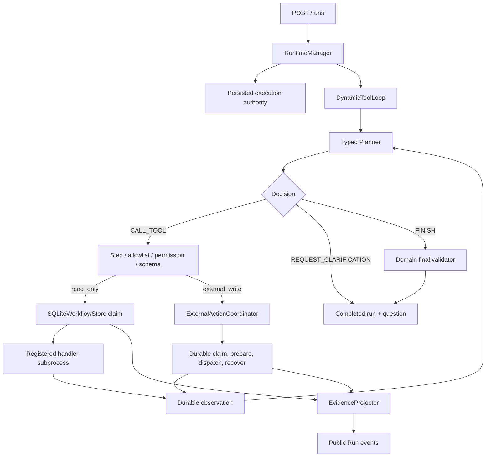

# Policy-Governed Dynamic Tool Loop

Phase 5A adds a domain-neutral Planner → Tool → Observation loop to the durable
runtime. Phase 7A extends the same loop with a durable provider path for explicitly
classified external writes. Travel is the first runnable reference adapter;
tool-loop policy and recovery code do not import Travel or release-validation modules.

## Runtime shape



`DynamicToolLoop` sees JSON state, registered tool descriptors, observations,
and a domain callback that validates `FINISH`. It does not parse destinations,
budgets, release manifests, or any other domain field. `ToolEffect` and
`ToolRetryMode` are server-controlled properties of a registered tool, not fields a
Planner or request body can choose.

The loop owns Planner orchestration, policy order, and read-only sandbox routing.
`ExternalActionCoordinator` owns the external-write state machine: durable prepare,
dispatch fencing, provider retries, exact terminal read-back, and restart recovery.
It is stateless between calls and uses the same workflow store and dispatcher supplied
to the loop. `EvidenceProjector` keeps the workflow ledger authoritative, then mirrors
the existing evidence allowlist into public Run events. `runtime_service/canonical.py`
holds the identity primitives both sides share — canonical JSON encoding, the stable
hash built on it, and persisted tool-result decoding — so the two owners cannot drift
apart on what makes two records the same record. These ownership boundaries do not
change tool schemas, persisted states, event payloads, retry limits, or recovery
semantics for the currently supported action states and host failure table.

The coordinator resolves its failure text through `failure_message()`, falling back to
`ExternalActionCoordinator.DEFAULT_FAILURE_MESSAGES` when a host supplies a narrower
table, and ranks known reconciliation candidates through `_RECONCILE_PRIORITY`. If any
dispatched action has an unranked status, or remains `PREPARED` despite a non-zero
dispatch count, reconciliation stops before selecting a sibling and keeps the Run
pending. Both decisions sit on paths that run only after a provider call may already
have been applied, so neither may raise `KeyError` or terminalize the Run without
understanding every dispatched status.

Every `EXTERNAL_WRITE` `ToolSpec` also requires a server-owned Pydantic
`output_model` configured with `extra="forbid"`. Provider output is normalized
through that allowlist before it can be stored or shown; the provider cannot
expand the durable/public result shape.

## Typed decisions

Planner output is a strict discriminated union. Unknown fields are rejected.

- `CALL_TOOL`: registered tool name, JSON arguments, and a bounded reason.
- `REQUEST_CLARIFICATION`: one question and reason.
- `FINISH`: a message, domain payload, and reason.

The default `ScriptedTravelPlanner` is stateless and deterministic. It derives
each call from the current observation:

1. parse structured Travel constraints in the Travel adapter;
2. call `search_trip_options`;
3. pass the returned options into `rank_trip_options`;
4. pass the actual ranking winner's cost components into
   `route_cost_summary`;
5. finish only when `within_budget` is true, otherwise ask whether the user
   wants to raise the budget or relax a preference.

This is not a fixed DAG disguised as planning: changing a search or ranking
result changes the next tool arguments, and the cost result selects the final
branch.

For `travel-agent:1.2.0`, `DurableActionTravelPlanner` wraps that base Planner.
On every call it removes `create_trip_hold` from the descriptors passed to the
base/model Planner, which sees only the three read-only tools. `plan_only`
preserves valid read-only decisions, but a base Planner that fabricates
`CALL_TOOL create_trip_hold` is rejected. With explicit
`requested_action="create_hold"`, non-finish read-only decisions pass through;
only when the base would `FINISH` does the wrapper reconstruct the candidate from
persisted search/rank/cost evidence and run the deterministic Travel validator.
Only the wrapper can then insert `CALL_TOOL create_trip_hold`. After a matching
successful hold observation, it returns the original base `FINISH`. An invalid
finish therefore cannot trigger the side effect before final runtime validation.

## Policy order and failures

Every `CALL_TOOL` is checked before a workflow step is claimed, a subprocess is
started, or provider code is entered, in this order:

1. tool-call step limit;
2. tool exists in this runtime's server-owned registry;
3. persisted execution authority includes `tools:execute`;
4. for `EXTERNAL_WRITE`, persisted authority also includes
   `external-actions:execute`;
5. the tool's server-only `runtime_input_gate`, when present, accepts the durable
   runtime input;
6. the registered provider exists and a `PROVIDER_IDEMPOTENT` provider declares
   idempotency support;
7. arguments validate against the tool's Pydantic schema.

The run exposes a stable `error_code` when the runtime fails:

| Error code | Meaning |
| --- | --- |
| `unknown_tool` | Planner selected a tool outside the allowlist. |
| `invalid_tool_arguments` | Arguments failed the registered schema. |
| `tool_permission_denied` | Persisted authority lacks tool execution permission. |
| `tool_timed_out` | The registered subprocess exceeded its deadline. |
| `tool_execution_failed` | A registered handler or executor failed. |
| `step_limit_exceeded` | Planner requested another tool after the bounded limit. |
| `invalid_planner_decision` | Planner/provider output or durable decision identity was invalid. |
| `planner_provider_failed` | The configured planner provider could not return a response. |
| `external_action_permission_denied` | Persisted authority lacks external-action permission. |
| `external_action_not_requested` | The external-write tool's server-owned runtime-input gate rejected this run input. |
| `external_action_not_configured` | The server-owned tool/provider path is incomplete. |
| `external_action_idempotency_unsupported` | A provider-idempotent tool resolved to a provider without that capability. |
| `external_action_failed` | The provider definitively rejected or failed the action. |
| `external_action_outcome_unknown` | The action may have happened and cannot safely be classified after the bounded retry policy. |
| `external_action_evidence_incomplete` | The action succeeded, but its durable public run evidence could not be mirrored after two complete attempts. |
| `run_cancel_requested` | Cancellation committed before the first provider dispatch. |

`run_cancel_requested` is the loop's boundary signal; the manager normally
finalizes that run as `cancelled` rather than exposing it as a failed run code.

Policy denial tests assert that no sandbox/provider call and no `tool_calls` or
`external_actions` row occurs.

For Travel, `create_trip_hold` owns a server-only gate that requires
`requested_action="create_hold"`. If a `plan_only` run reaches that tool decision,
including by replaying a forged persisted decision, the loop returns
`external_action_not_requested` before any step/action claim and dispatches the
provider zero times. This check is independent of the wrapper's three-tool
Planner view.
Domain validation is different from runtime failure: a structurally valid
`FINISH` that violates Travel evidence or a hard constraint produces a
completed run with `current_stage="blocked"` and `validation_errors`.

## Durable evidence and recovery

Phase 5A reuses both SQLite stores:

- `workflow_executions`, `tool_calls`, and `workflow_events` form the internal
  execution ledger;
- `run_events` is the user-visible trace returned by REST and SSE.

Each decision has a stable index and evidence id. Dynamic tool steps use
`call-0001`, `call-0002`, and so on. `EvidenceProjector` writes the workflow
ledger before its run-event mirror; startup recovery backfills a missing mirror
if a process stopped between those commits. It deduplicates by
`(event_type, evidence_id)` and mirrors only Planner, policy, tool, loop-outcome,
and `external_action.*` evidence. For the runtime's string evidence IDs, a mirror pass
lists the public Run stream at most once and tracks its own appends, so scan work is
linear in the workflow and public event counts rather than quadratic.

The visible sequence is:

```text
planner.decision
policy.decision
external_action.prepared                  # external_write only
external_action.dispatch_started         # external_write only
external_action.succeeded | failed | outcome_unknown
tool.result
... next planner decision ...
loop.outcome
```

Read-only calls omit the `external_action.*` events and continue through the
registered subprocess sandbox.

On restart, a persisted Planner decision is replayed instead of asking a model
to make a different decision for the same index. Completed tool results rebuild
observations without rerunning the subprocess. A `RUNNING` tool step is marked
interrupted only at an explicit manager restart boundary and then receives a
new attempt token. A real persisted tool failure is not silently retried.

For an external write, `external_actions` records the canonical arguments,
logical provider route, stable concrete `provider_identity`, retry contract,
dispatch token/count, terminal result or stable error, and sanitized provider
reference. The loop persists `prepared` intent before
provider entry. Its stable provider idempotency key is derived on the server from
the durable tenant/run/workflow/step/tool/input identity; it is never accepted
from the Planner and is omitted from public evidence.

Recovery uses the action row rather than treating a provider call like a normal
subprocess retry:

- `prepared` can proceed to its first dispatch after cancellation arbitration;
- `dispatching` with `PROVIDER_IDEMPOTENT` reuses the same key and can rotate the
  dispatch token, with at most two total provider dispatches;
- `dispatching` with `UNSAFE` is never blindly retried and becomes
  `outcome_unknown`;
- `succeeded` restores the persisted observation and provider reference without
  another provider call;
- `failed` and `outcome_unknown` remain terminal.

After a provider success is atomically stored in the action/tool ledger, the
loop makes up to two complete attempts to mirror `external_action.succeeded` and
the matching `tool.result` into `run_events`. If both attempts fail, it does not
re-dispatch or roll back the provider result: the action remains `succeeded`,
and the run fails with `external_action_evidence_incomplete`.

Recovery will not turn post-dispatch drift into an ordinary, potentially
retryable policy or validation failure. If the thread-state/workflow identity,
server-owned runtime-input gate, registered tool effect or schema, persisted
permission, provider routing/configuration, or declared provider
identity/idempotency capability no longer matches an in-flight dispatched
action, the loop performs no provider replay and finalizes/reports
`external_action_outcome_unknown`. Already-terminal actions retain their
stronger ledger classification: a succeeded action reports
`external_action_evidence_incomplete` if it cannot be reconciled into run
evidence, while a definitive failure remains `external_action_failed`.

`provider_identity` is a stable, explicit, non-sensitive deployment/account
binding, distinct from the logical provider route, endpoint, or credentials.
Token rotation may retain the same identity; changing the backing account or
deployment must change it. The identity is part of the prepared action binding,
so an in-flight mismatch is never re-dispatched under the new identity.

After provider entry, the loop injects the trusted top-level
`provider_reference`, validates the complete result with the tool's
`output_model` (`extra="forbid"`), and persists only the normalized model. For a
Travel hold, the result must match the prepared destination, selected option
name, quoted total, and hold duration, and the trusted reference must be an
opaque `hold_` identifier. Undeclared extra, debug, or secret fields from a
provider response do not enter the action/tool ledger, Travel state, or public
run evidence. Invalid or mismatched output is ambiguous and uses the bounded
retry/`outcome_unknown` path without storing the raw payload.

Finalizing a provider outcome updates the action row and its parent tool result
in one transaction. This is durable intent plus explicit recovery semantics, not
an exactly-once guarantee. See
[`durable-external-actions.md`](durable-external-actions.md) for the complete state
and cancellation contract.

The API snapshots the authenticated subject, tenant, and server-evaluated
effective permissions into an internal `execution_authority_json` field when
the run is first created. Workers and restart recovery use that snapshot; they
do not trust request fields or recalculate permissions from a later role
configuration. Idempotent resubmission does not replace the first authority.

Before the initial provider dispatch, `begin_external_action_dispatch` checks
the run status and cancel bit in the same SQLite write transaction that claims
`prepared -> dispatching`. If cancellation committed first, provider code is not
called. Once dispatch has started it cannot be retracted: an action can succeed,
then a later run-finalization boundary can observe cancellation and mark the run
cancelled. The successful action and provider reference remain durable; Phase 7A
does not compensate or undo them. An uncertain action outcome is likewise not
hidden by concurrent cancellation. Cancellation also cannot mask
`external_action_evidence_incomplete`, because doing so would hide a provider
success whose public run evidence is incomplete.

## Travel reference behavior

`travel-agent:1.0.0`, `1.1.0`, and `1.2.0` are explicit pinned versions. The
default version remains `0.3.0`; `0.5.0` and both release-validation versions
keep their existing behavior.

Travel owns:

- natural-language constraint extraction;
- synthetic tool schemas, registries, and handler entrypoints;
- scripted planner instructions;
- final payload mapping and deterministic `TravelValidator` gate.

The `1.0.0` and `1.1.0` loops each receive their own instance from
`build_travel_tool_registry`: exactly the three synthetic read-only tools and the
unchanged `TravelMessageInput` schema. `1.2.0` uses the separate
`build_travel_external_action_tool_registry` and `TravelExternalActionInput`,
which adds `requested_action: Literal["plan_only", "create_hold"] = "plan_only"`.
Pinned old schemas and registries are not mutated by the new version.

That four-tool registry is private to the version-pinned durable loop. Public
`GET /tools` and the direct sandbox continue to expose only the three read-only
tools.

The original package-level `runtime_service.build_default_tool_registry`
builder remains as a compatibility composition wrapper. New integrations
should import the domain-owned Travel registry builders directly.

The search tool returns a deterministic `synthetic_reference_catalog`. It is
designed to make CI and demos repeatable and is not live flight or hotel
inventory. The `1.2.0` `create_trip_hold` tool is classified
`EXTERNAL_WRITE`/`PROVIDER_IDEMPOTENT` and routes to the registered
`travel-trip-hold` provider rather than the sandbox. The default
`SQLiteTripHoldProvider` is a deterministic test double with its own SQLite file:
same key and canonical payload return the same synthetic reference; the same key
with different arguments is a definitive conflict.

Setting `RUNTIME_TRAVEL_ACTION_PROVIDER_URL` binds the same logical route to the
injectable JSON-over-HTTP adapter. HTTP mode also requires the explicit,
non-secret `RUNTIME_TRAVEL_ACTION_PROVIDER_IDENTITY`; the optional
`RUNTIME_TRAVEL_ACTION_PROVIDER_BEARER_TOKEN` remains server configuration. This
does not change the base Planner's filtered three-tool read-only view or the
wrapper-only action insertion rule, and it does not establish that a live Travel
provider has been validated.

The HTTP adapter defaults to `supports_idempotency=false`. Since the Travel tool
requires `PROVIDER_IDEMPOTENT`, the policy gate rejects the action before a
`tool_calls` or `external_actions` row is created unless deployment
configuration explicitly sets
`RUNTIME_TRAVEL_ACTION_PROVIDER_SUPPORTS_IDEMPOTENCY=true`. That assertion must
reflect the endpoint's real contract; the presence of an `Idempotency-Key`
header alone is not proof.

HTTPS is the default and the only production transport. Every non-loopback `http://`
endpoint is rejected whether or not it uses Bearer authentication. Loopback
HTTP is restricted to explicit development and requires
`RUNTIME_TRAVEL_ACTION_PROVIDER_ALLOW_INSECURE_LOCALHOST=true`, even without a
Bearer token; the flag never permits plaintext dispatch to a remote host.

Only `200` and `201` are eligible for synchronous HTTP success, subject to the
bounded typed-body and output-model checks. Every other status is ambiguous by
default. The adapter accepts a server-only `definitive_status_codes` constructor
option for a small, explicitly verified set of `4xx` statuses whose provider
contract guarantees no effect. The API exposes no environment variable for
this option, so the default configured set is empty.

This is not live booking, payment, inventory, or an official vendor sandbox.
An authorized `POST /tools/create_trip_hold/execute` returns `409` (and missing
external-action permission returns `403`), so direct tool execution cannot
bypass the durable action ledger.

A clarification finishes the current run normally and stores
`current_stage="needs_clarification"`. The user supplies the missing or changed
constraint in another run of the same pinned Travel version on the same thread.

## Optional live model Planner

The offline default needs no model SDK or API key. A generic
`OpenAIResponsesPlanner` can replace the scripted Planner while keeping the
same policy loop, tools, validator, stores, and API.

```bash
pip install -r requirements-model-demo.txt
export RUNTIME_PLANNER_PROVIDER=openai
export OPENAI_API_KEY="..."
export OPENAI_MODEL="..."
python examples/model_driven_travel_demo.py
```

The adapter uses Responses function calling with strict schemas,
`tool_choice="required"`, `parallel_tool_calls=false`, and `store=false`.
Registered tools plus typed `request_clarification` and `finish` pseudo-functions
are the only accepted calls. CI uses a fake Responses client and does not claim
to call a live model. Missing configuration, an absent optional SDK, provider
errors, invalid JSON, zero calls, or multiple calls all fail closed.

The provider is not asked to emit a free-form reason for terminal decisions;
the adapter inserts fixed operational labels. Dynamic evidence stores typed
decisions/results, not the system prompt, raw provider response, or a
provider-supplied terminal reason. Choose a standard model that supports strict
Structured Outputs as described in the
[OpenAI function-calling guide](https://developers.openai.com/api/docs/guides/function-calling).

The model-driven demo changes only Planner decisions and targets the
`travel-agent:1.0.0` three-tool path. Its Travel data remains synthetic and it
does not perform a booking.
