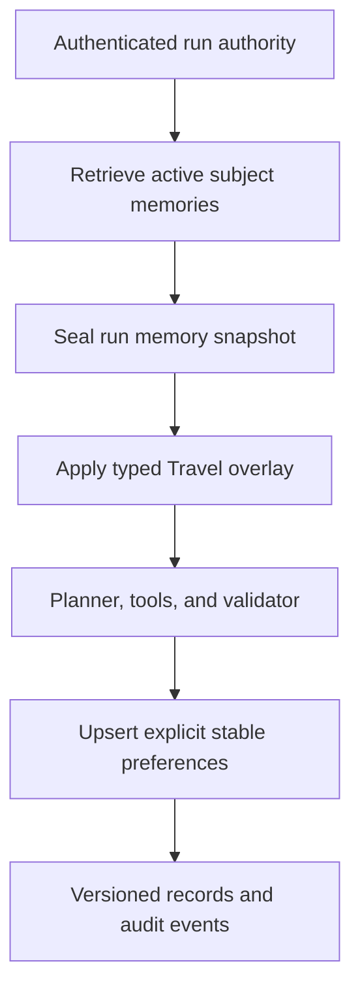

# Governed cross-thread memory

Phase 6A adds an opt-in `travel-agent:1.1.0` path for durable subject-level memory. It is
deliberately separate from thread checkpoints:

- a thread checkpoint restores task state for one tenant-qualified `thread_id`;
- a memory record carries an explicit stable preference across threads for one authenticated
  `(tenant_id, subject_id)`;
- a run memory snapshot seals exactly what a run retrieved, so restart and replay do not observe
  a later preference update.

SQLite is the only storage dependency. Phase 6A does not add embeddings, vector search,
conversation-history replay, inferred profile facts, summarization, or an external memory service.

`travel-agent:1.2.0` inherits this same Phase 6A boundary: the same explicit preference parser,
subject scoping, precedence, sealed per-run snapshot, audit evidence, and forgetting semantics.
Its additional `requested_action` field and external-action ledger do not create a second memory
model or make `1.0.0` memory-aware. The published `1.1.0` input schema remains unchanged.

## Supported vertical slice

Only explicit Travel preferences on a fixed domain allowlist are extracted:

The strict explicit-intent parser is pinned to `travel-agent:1.1.0` and inherited by
`travel-agent:1.2.0`. The published
`travel-agent:1.0.0` registration retains its Phase 5A compatibility parser, including its broader
substring semantics, so recovery and replay do not silently change behavior for an existing
version.

| Memory key | Typed value | Travel state input |
| --- | --- | --- |
| `flight.avoid_red_eye` | `bool` | `preferences.avoid_red_eye` |
| `hotel.near_subway` | `true` | `preferences.hotel_near_subway` |
| `travel.style` | `"relaxed"` | `preferences.travel_style` |

Destination, dates, trip length, and budget remain task state. They are not assumed to be stable
user preferences. Unknown keys or invalid values fail the run with `invalid_memory_record` instead
of entering Planner context.

The precedence order is:

1. an explicit preference in the current user message;
2. the active record in the run's sealed memory snapshot;
3. the existing thread checkpoint.

Retrieved values are an execution overlay. They influence Planner decisions, tool arguments, and
deterministic validation, but values injected by `1.1.0` or `1.2.0` are not copied into the
preference fields saved back to the thread checkpoint. This prevents a deleted or superseded
memory overlay from being resurrected by a later turn on that thread. The run still retains its
immutable result, trace, tool evidence, and memory snapshot.

## Persistence model

`memory_records` stores versioned records with `active`, `superseded`, or `deleted` status. A
partial unique index allows only one active version for a logical
`(tenant_id, subject_id, domain_id, kind, key)` identity. Updating a value supersedes the prior
row and creates the next integer version in one `BEGIN IMMEDIATE` transaction.

`memory_events` is append-only mutation evidence. It records `memory.created`,
`memory.superseded`, and `memory.deleted` without copying the preference value into event payloads.
Run-linked create/supersede events are mirrored into the normal run event stream idempotently.

`run_memory_snapshots` stores one JSON snapshot per `run_id`, including an explicit empty snapshot.
The row is bound to the persisted run's tenant, subject, and domain authority. A retry or recovered
worker always reuses that row even if active memory has changed since the first attempt.

## Retrieval, update, and forgetting

On the first `travel-agent:1.1.0` or `travel-agent:1.2.0` attempt, the worker:

1. verifies the persisted execution authority includes `memory:read`;
2. retrieves only allowlisted active, unexpired records for the authority's tenant and subject;
3. seals the retrieval and appends `memory.retrieved` to the run event stream;
4. applies typed values before the Planner sees state;
5. after a normal loop outcome, extracts explicit allowlisted preferences from the current message;
6. verifies `memory:write`, commits any new versions, and mirrors mutation audit events.

Repeated writes of the same canonical JSON value are idempotent. A different value supersedes the
prior record. Memory mutation is not performed when the dynamic loop raises a failure before a
normal outcome.

The memory mutation transaction and the run's terminal completion compare-and-set are separate in
this SQLite slice. An explicit preference committed after a normal loop outcome is not rolled back
if cancellation wins at the later run-finalization boundary. Transactional outbox/approval
semantics for consequential or externally backed memory writes remain outside Phase 6A.

`DELETE /memories/{memory_id}` tombstones and value-redacts every stored version of that logical
key for the authenticated subject. Future runs retrieve nothing for it. Previously sealed run
snapshots, run states, and tool evidence remain immutable reliability evidence; this endpoint is
therefore operational forgetting for future Agent behavior, not erasure of historical run logs.

## Authorization and isolation

The static RBAC policy adds three independent permissions:

| Permission | Viewer | Operator | Enforcement point |
| --- | ---: | ---: | --- |
| `memory:read` | yes | yes | list API and async retrieval |
| `memory:write` | no | yes | async extraction/upsert |
| `memory:delete` | no | yes | forget API |

Memory list and delete operations always derive tenant and subject from the authenticated
principal. They do not accept either identifier in the request body or query. A memory belonging
to another subject or tenant returns the same `404` as an unknown id before action authorization
is evaluated.

Async workers do not recompute a current role. They use the effective permission snapshot stored
with the run at submission. Missing read or write authority fails closed with
`memory_permission_denied`.

## API and evidence

- `GET /memories` lists active memories for the current subject. Optional `domain_id` and `kind`
  filters are supported; `include_inactive=true` includes tombstoned and superseded history.
- `DELETE /memories/{memory_id}` forgets one logical key for the current subject.
- `GET /runs/{run_id}/events` and SSE include `memory.retrieved`, `memory.created`, and
  `memory.superseded` when they apply.

The retrieval event contains memory ids, keys, kinds, and versions, but does not duplicate values
or permission snapshots. The current subject can inspect the exact record through the memory API,
and the worker reads the exact value from its sealed internal snapshot. As expected, an applied
preference can also be evident in normal Planner decisions, tool arguments, and terminal run
evidence; operational forgetting does not rewrite those historical records.

## Verification boundary

The full memory-focused coverage proves:

- an explicit preference in Thread A survives service restart and changes tool arguments in
  Thread B for the same subject;
- the same tenant's other subject and another tenant retrieve no record and cannot delete it;
- Viewer can read but cannot forget, while Operator can read, write through execution, and forget;
- conflicting writes create ordered versions and append non-value audit evidence;
- current-run and persisted preference updates share one explicit-intent parser; supported
  negative intent supersedes prior values, while ambiguous keyword mentions fail closed;
- `travel-agent:1.0.0` and `1.1.0` retain distinct pinned parsers across normal execution and
  restart recovery;
- an invalid stored value fails before the Planner can act on it;
- empty and non-empty run snapshots remain sealed across later writes;
- retry mirroring repairs a committed mutation/run-event gap without duplicate evidence;
- deletion prevents future use even when continuing an existing memory-aware thread;
- missing persisted `memory:read` or `memory:write` authority fails with a stable error code;
- `travel-agent:1.2.0` reuses the `1.1.0` explicit parser and sealed retrieval semantics while
  keeping its action request and action evidence separate from memory records;
- `travel-agent:1.0.0` remains memory-free for pinned Phase 5A behavior.
