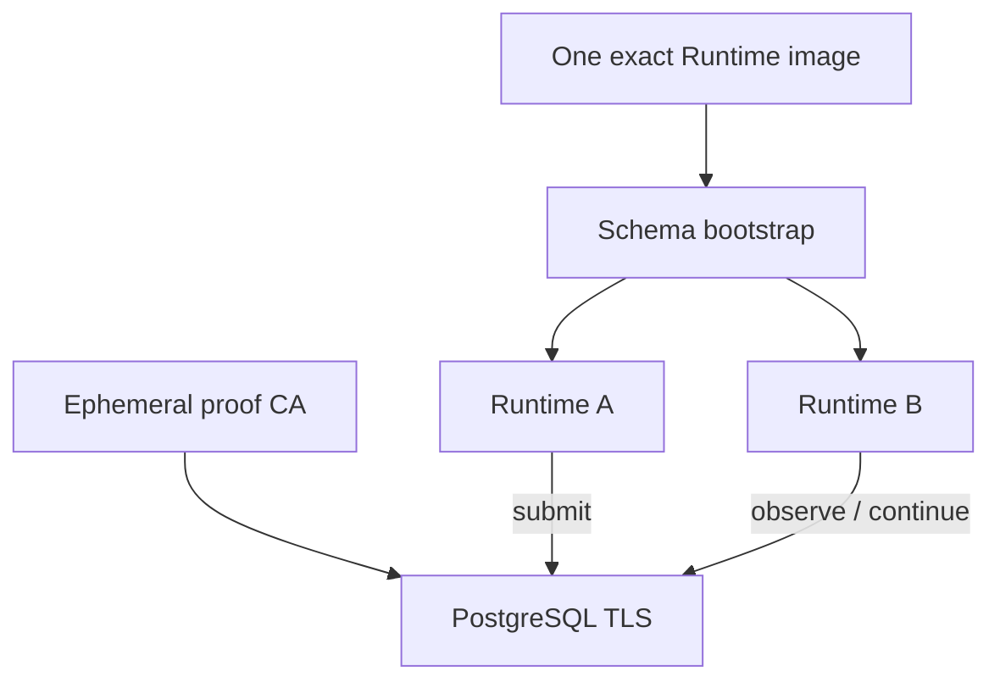

# P6B.2 exact-image PostgreSQL TLS and lifecycle proof

## Problem

P6B.1 made the production process fail closed and P6A encoded the AWS resource graph, but neither
proves that one real production image can complete its lifecycle against PostgreSQL. Unit tests can
validate configuration parsing, and Terraform mock plans can validate resource composition, but
they cannot prove certificate hostname verification, image identity, cross-container durable
authority, emitted log bytes, or signal behavior.

The user-visible risk is a deployment that looks correct in review yet fails only after it reaches a
container platform: a mutable image tag, a DSN that encrypts without authenticating the server, a
schema that was never bootstrapped, process-local state shared accidentally, a secret in logs, or a
container killed before its RuntimeManager drains.

## Existing mechanisms and value gap

| Existing mechanism | What it proves | Missing evidence |
| --- | --- | --- |
| P6B.1 unit and process tests | Bounded configuration, fail-closed storage/provider selection, JSON formatter | Real image, real TLS, two containers |
| Local demo Compose | Action recovery through the image entrypoint | SQLite/demo authority and a shared network namespace |
| PostgreSQL conformance/P5 | Store semantics and two independent Python worker processes | Production image, certificate identity, container signals |
| P6A Terraform mock plans | AWS topology, IAM, secret and lifecycle preconditions | Provider runtime behavior and exact image execution |

P6B.2 adds one deterministic acceptance harness instead of another application abstraction. It can
build a local candidate image, or consume a registry image already pinned as
`repository@sha256:...`. P6C must use the second mode for the exact ECR digest selected for AWS.

## Why each component is necessary

- A private proof CA and a server certificate with only `DNS:postgres-tls` make hostname
  authentication observable.
- A second DNS alias, `postgres-wrong-host`, is the negative control. The same CA trusts the
  certificate, but `sslmode=verify-full` must reject the wrong name before schema work. A helper
  inside the exact image classifies the libpq failure and emits only bounded JSON; raw connection
  errors and the DSN are never retained as evidence.
- The one-shot bootstrap container uses the production image and must finish successfully before
  either Runtime starts.
- Runtime A and Runtime B are distinct containers with no shared application volume. Both use the
  same image config digest and PostgreSQL authority.
- A release-validation Run is submitted through A and read through B. After a bounded SIGTERM stop
  of A, B must remain ready and complete a second durable transition.
- PostgreSQL connection logs must identify TLS sessions for bootstrap, Runtime A, and Runtime B.
- Runtime logs must be JSON lines, contain the complete Uvicorn shutdown sequence, and contain zero
  occurrences of the database-password and API-key canaries.

The application still decides Run semantics. The proof harness only performs deterministic setup,
API calls, postcondition checks, evidence reduction, and cleanup.

## Proof topology



No cloud credential, metadata endpoint, cloud SDK, or AWS API is involved.

## Deterministic sequence

```text
resolve exact source revision
-> build the explicit linux/amd64 image and read Buildx manifest/config digests
   OR pull an explicitly digest-pinned registry image
-> generate ephemeral CA and postgres-tls certificate
-> start PostgreSQL
-> prove postgres-wrong-host is rejected by verify-full
-> apply and validate both schema components through the exact image
-> start Runtime A and Runtime B from the same image config digest
-> validate /ready PostgreSQL and release identities on both
-> submit through A, observe terminal evidence through B
-> SIGTERM Runtime A, require complete JSON shutdown evidence and exit 143
-> recheck B readiness and complete another durable transition
-> SIGTERM Runtime B and require the same shutdown evidence
-> correlate PostgreSQL SSL logs and scan every collected log for canaries
-> write one bounded, secret-free JSON artifact
-> remove containers, volumes, generated keys, certificates, and local image tag
```

Run the proof on a machine with Docker Buildx, Docker Compose, and OpenSSL:

```bash
python -u examples/p6b2_exact_image_proof.py
```

To re-run the same harness on an already published image, both values are mandatory and the image
reference itself must contain the same digest:

```bash
export P6B2_SOURCE_REVISION=<exact-commit>
export P6B2_IMAGE_DIGEST=sha256:<64-lowercase-hex>
export P6B2_IMAGE_REF=registry.example/runtime@${P6B2_IMAGE_DIGEST}
python -u examples/p6b2_exact_image_proof.py
```

The artifact is `artifacts/p6b2-exact-image-proof.json`. It records identity and postconditions,
not raw logs, credentials, DSNs, certificate keys, or request headers.

## Claim boundary

Passing this proof means the harness and selected image satisfy the portable lifecycle under a
Docker bridge and ordinary PostgreSQL 16. It does not prove RDS reachability, the AWS RDS CA bundle,
regional image availability, ECS stop reasons, ECR digest rereads, cost, or teardown. Those remain
P6C postconditions and require explicit authorization.
